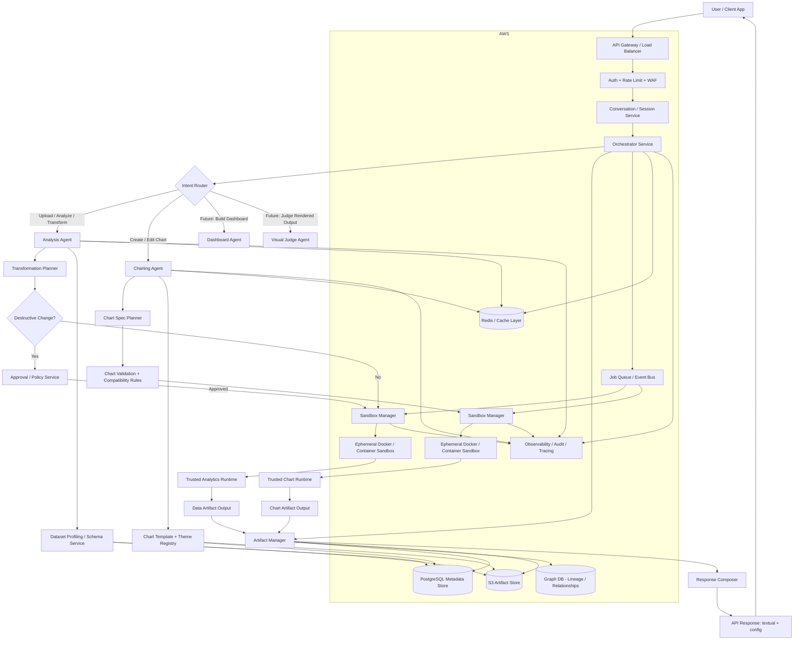
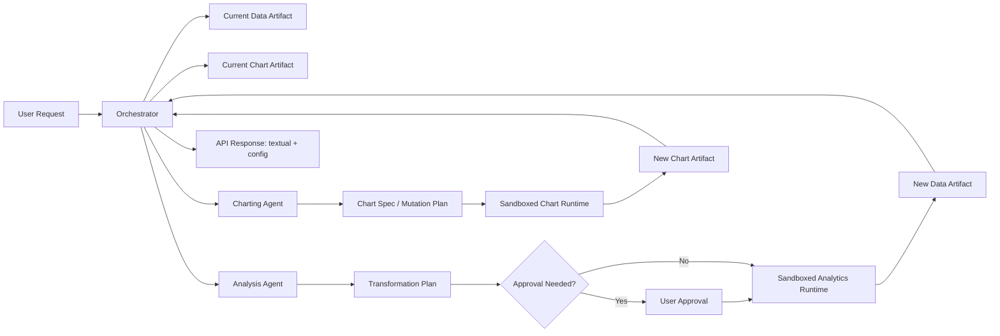

Absolutely — and your concern about sandbox security is valid.

If this is meant for millions of users, then the system cannot be a simple “LLM + pandas + chart config” pipeline. It has to be a distributed, modular, secure analytics platform with strict separation between:
	•	data artifact manipulation
	•	chart artifact manipulation
	•	orchestration / policy
	•	storage / caching / session state
	•	sandboxed execution

And yes: your idea of 2 agents manipulating 2 artifacts is actually very strong.

That gives you a clean boundary:
	•	Analysis Agent only reads/writes the data artifact
	•	Charting Agent only reads/writes the chart spec artifact
	•	neither directly mutates the other’s internal state
	•	orchestrator controls handoff

That is much safer, more explainable, and easier to scale.

⸻

Refined architectural idea

Core artifacts

1. Data Artifact

Represents the dataset state for a session/version.

Contains things like:
	•	dataset id
	•	original file reference
	•	schema
	•	profiling metadata
	•	transformation log
	•	transformed data reference
	•	sampled views
	•	chart-ready extracts

2. Chart Artifact

Represents the visualization state.

Contains things like:
	•	chart version id
	•	chart type
	•	semantic role mapping
	•	theme
	•	chosen library: Highcharts or Highstock
	•	final config object
	•	mutation history

This is a very good design because:
	•	the analysis agent never edits chart config directly
	•	the charting agent never edits raw data directly
	•	orchestration becomes deterministic
	•	future dashboard agent can consume both artifacts

⸻

Security concern: sandboxing

You are right to worry.

If users upload arbitrary CSV/Excel and request transformations, and your agents run code against those artifacts, then you need strong isolation.

Recommended approach

Use ephemeral container-based execution sandboxes.

Not one giant shared sandbox.

Instead:
	•	each job/session gets isolated execution
	•	sandbox reads only the allowed artifact snapshot
	•	sandbox has no broad network access by default
	•	sandbox is short-lived
	•	sandbox writes only approved outputs
	•	after execution, sandbox is destroyed

That is far safer than a persistent shared environment.

Better than “one sandbox per user forever”

I would recommend:
	•	ephemeral job sandbox for actual execution
	•	session state stored outside sandbox
	•	artifacts persisted in object/database storage
	•	sandbox recreated when needed

So the sandbox is compute-only, not stateful.

That way:
	•	compromise blast radius is tiny
	•	stale state does not leak
	•	autoscaling becomes easier
	•	retries are easier
	•	auditability is better

⸻

Important security principle

Do not let agents freely execute arbitrary generated code without policy checks.

Instead:
	•	orchestrator interprets request
	•	converts it into approved operation plan
	•	sandbox executes from a controlled tool library
	•	not arbitrary shell/python unless explicitly allowed internally

So rather than:
	•	“LLM writes pandas code and runs it directly”

prefer:
	•	“LLM outputs structured transform plan”
	•	“trusted execution engine applies plan”

Example structured plan:

{
  "operations": [
    {"type": "drop_nulls", "columns": ["revenue"]},
    {"type": "groupby", "by": ["region"], "metrics": [{"column": "sales", "agg": "sum"}]}
  ]
}

Then your trusted analytics runtime executes that plan.

This is much safer.

⸻

Scalable system design

For millions of users, the architecture should be service-oriented, event-driven where useful, and horizontally scalable.

Main platform building blocks

User-facing layer
	•	Web UI / Chat UI
	•	Public API Gateway

Application layer
	•	Auth service
	•	Session service
	•	Orchestrator service
	•	Policy/approval service

Agent layer
	•	Analysis Agent service
	•	Charting Agent service
	•	later: Dashboard Agent
	•	later: Visual Judge Agent

Execution layer
	•	sandbox manager
	•	job queue
	•	ephemeral containers
	•	artifact loaders/savers

Data/storage layer
	•	PostgreSQL
	•	Graph DB
	•	S3
	•	Redis/cache
	•	observability/logs

Infra layer
	•	AWS EKS / ECS
	•	SQS / Kafka
	•	Lambda for lightweight async tasks
	•	CloudWatch / OpenTelemetry
	•	IAM / KMS / VPC / WAF

⸻

Why PostgreSQL + Graph DB + S3 all make sense

PostgreSQL

Use for:
	•	users
	•	sessions
	•	dataset metadata
	•	chart metadata
	•	version history
	•	approvals
	•	audit logs
	•	API keys / tenant metadata
	•	structured artifact references

Graph DB

Use for:
	•	conversation-to-artifact relationships
	•	chart lineage
	•	dashboard composition
	•	semantic field relationships
	•	entity linkage across datasets
	•	future knowledge-graph-based reasoning

Example graph relationships:
	•	User → Session
	•	Session → DataArtifact
	•	Session → ChartArtifact
	•	ChartArtifact_v4 → derived_from → ChartArtifact_v3
	•	ChartArtifact → uses_field → revenue
	•	DataArtifact → transformed_from → original_dataset

This becomes very useful later for multi-step conversational editing and provenance.

S3

Use for:
	•	uploaded CSV/Excel/PDF
	•	transformed dataset snapshots
	•	sampled extracts
	•	chart artifact JSON blobs
	•	dashboard specs
	•	render previews later
	•	logs/exports/backup files

S3 should hold the heavy blobs.
Postgres should hold metadata and references.

⸻

Full system flowchart

Below is a full system flowchart in Mermaid.

⸻

Expanded architecture by responsibility

1. API Gateway Layer

Purpose:
	•	route requests
	•	auth
	•	throttling
	•	request size limits
	•	tenant isolation
	•	abuse prevention

AWS options:
	•	API Gateway or ALB
	•	WAF
	•	Cognito or custom auth
	•	rate limiting

2. Session / Conversation Service

Purpose:
	•	maintain session state
	•	know current dataset
	•	know current chart version
	•	know theme preference
	•	know whether follow-up mutates or branches

This service should not store giant artifacts directly.
It should store references.

3. Orchestrator Service

This is the brain of the system.

Responsibilities:
	•	understand user intent
	•	choose analysis vs charting vs mutation flow
	•	enforce policy
	•	fetch the right artifact versions
	•	coordinate sandbox execution
	•	build final response

This is where your LLM-based orchestration lives.

4. Artifact Manager

This is one of the most important services.

Responsibilities:
	•	create artifact IDs
	•	store versions
	•	track lineage
	•	retrieve current version
	•	resolve session state
	•	persist metadata in Postgres
	•	persist blobs in S3
	•	persist relationships in Graph DB

This gives you reproducibility and audit.

⸻

Best design for the 2-agent artifact model

Here is the cleanest structure.

Analysis Agent

Input:
	•	user request
	•	current data artifact reference
	•	session context
	•	policy constraints

Output:
	•	proposed transformation plan
	•	optional approval request
	•	updated data artifact
	•	textual summary

It manipulates only:
	•	data artifact

It never edits:
	•	chart config directly

Charting Agent

Input:
	•	user request
	•	current data artifact reference
	•	current chart artifact reference if editing
	•	theme preferences

Output:
	•	semantic chart spec
	•	updated chart artifact
	•	textual summary
	•	final Highcharts/Highstock config

It manipulates only:
	•	chart artifact

It never edits:
	•	raw dataset directly

This separation is excellent.

⸻

But one subtle issue

Sometimes the charting request implies data preparation.

Example:
	•	“create top 10 products by sales bar chart”
	•	“make monthly stock chart”
	•	“show average revenue by region”

These require aggregation or filtering.

So the charting agent should not do the data manipulation itself.
Instead it should ask orchestrator for a derived chart-ready data artifact from analysis.

So the flow becomes:
	1.	user asks for chart
	2.	charting agent realizes chart-ready slice is missing
	3.	charting agent requests analysis operation
	4.	analysis agent creates derived data artifact
	5.	charting agent consumes that artifact and builds config

That preserves clean boundaries.

⸻

Recommended scalable deployment model on AWS

For millions of users, I would recommend something like this:

Compute
	•	EKS if you want maximum flexibility and multi-service orchestration
	•	ECS Fargate if you want simpler container operations
	•	sandbox workers can run as isolated jobs or short-lived tasks

Storage
	•	S3 for file/blob artifacts
	•	RDS PostgreSQL / Aurora PostgreSQL for relational metadata
	•	Neptune or another managed graph database for artifact lineage / semantic graph
	•	ElastiCache Redis for caching

Queueing / async
	•	SQS for job dispatch
	•	optionally SNS/EventBridge for events
	•	optionally Kafka/MSK if event traffic becomes very large and complex

Security
	•	VPC private subnets
	•	IAM roles per service
	•	KMS encryption
	•	WAF
	•	Secrets Manager
	•	no public DBs
	•	egress restrictions on sandboxes
	•	image scanning for containers

Observability
	•	CloudWatch
	•	OpenTelemetry
	•	centralized audit logs
	•	tracing across orchestrator, agents, sandboxes

⸻

Sandbox security recommendations

Your instinct about Docker is correct, but Docker alone is not enough.

For safe execution, the sandbox should have:

Isolation controls
	•	ephemeral filesystem
	•	CPU/memory/time limits
	•	no privilege escalation
	•	read-only base image
	•	network disabled or tightly restricted
	•	no shared writable volume except job scratch
	•	no host mounts
	•	no docker-in-docker
	•	no package install at runtime if possible

Execution controls
	•	only approved toolset available
	•	whitelist allowed libraries
	•	output size limits
	•	file count limits
	•	timeout-based termination
	•	explicit artifact input/output paths

Lifecycle
	•	create sandbox for job
	•	mount only job inputs
	•	run task
	•	collect outputs
	•	destroy sandbox

Additional hardening
	•	seccomp/apparmor
	•	non-root user
	•	signed container images
	•	vulnerability-scanned images
	•	malware scanning on uploads
	•	spreadsheet formula/macro handling carefully

Especially for Excel and CSV uploads, treat files as untrusted.

⸻

Important security warning for Excel/PDF inputs

If later you accept Excel/PDF and maybe render or parse them, you need protections against:
	•	malicious macros
	•	formula injection
	•	zip bombs
	•	parser exploits
	•	huge memory payloads
	•	path traversal in archive-like files

So the ingestion pipeline should include:
	•	MIME/type validation
	•	size limits
	•	parser isolation
	•	antivirus or malware scanning
	•	normalization before use
	•	macro stripping or rejection where needed

⸻

Better than “agents writing arbitrary code”

For production, the safest architecture is:

LLM outputs structured plans

Examples:
	•	transform plan JSON
	•	chart spec JSON
	•	mutation patch JSON

Trusted runtimes execute them

Examples:
	•	pandas/polars execution runtime
	•	chart config builder runtime
	•	config validator runtime

This makes the product:
	•	safer
	•	testable
	•	deterministic
	•	cheaper to operate
	•	less hallucination-prone

⸻

Scalable request flow

Here is the practical high-scale path.

Synchronous path for fast jobs

Used for:
	•	small datasets
	•	quick chart edits
	•	simple config generation

Flow:
	•	API call
	•	orchestrator
	•	artifact fetch
	•	lightweight sandbox execution
	•	response in-line

Asynchronous path for heavy jobs

Used for:
	•	huge files
	•	dashboard generation
	•	deep profiling
	•	PDF extraction later
	•	long-running visual critique

Flow:
	•	API call
	•	create job
	•	push to queue
	•	worker picks up
	•	outputs stored
	•	client polls or subscribes

For millions of users, you need both.

⸻

Recommended artifact versioning model

Data artifact lineage
	•	data_v0 = original upload
	•	data_v1 = null handling approved
	•	data_v2 = grouped by month
	•	data_v3 = filtered top 10 categories

Chart artifact lineage
	•	chart_v0 = initial recommendation
	•	chart_v1 = palette changed
	•	chart_v2 = x/y swapped
	•	chart_v3 = line changed to stock
	•	chart_v4 = title/theme updated

This is perfect for:
	•	auditability
	•	undo/redo
	•	explainability
	•	collaborative future product features

Graph DB is very helpful here.

⸻

Future VLM agent placement

Your future multimodal/VLM judge fits well as a post-render feedback loop.

Future flow
	1.	chart config generated
	2.	UI renders preview
	3.	preview image passed to visual judge
	4.	judge returns suggestions:
	•	reduce label density
	•	rotate category labels
	•	enlarge margins
	•	switch to horizontal bars
	•	use fewer series
	5.	charting agent applies safe patch
	6.	new chart version created

So that agent should not replace charting.
It should act as a:
	•	critic
	•	evaluator
	•	layout improver
	•	dashboard arranger

⸻

Suggested technology stack

Core backend
	•	FastAPI for API layer
	•	LangGraph or custom orchestrator for agent workflows
	•	Pydantic for contracts
	•	pandas or polars for data manipulation
	•	Highcharts/Highstock JSON template registry
	•	PostgreSQL / Aurora PostgreSQL
	•	Graph DB like Neptune
	•	S3 for artifacts
	•	Redis for cache
	•	SQS/EventBridge for async jobs

Container/execution
	•	Docker images for execution runtimes
	•	ECS/EKS for orchestration
	•	short-lived job containers
	•	hardened worker images

AWS security/infrastructure
	•	VPC
	•	IAM
	•	KMS
	•	Secrets Manager
	•	WAF
	•	CloudWatch
	•	OpenTelemetry

⸻

Final design principle I recommend

Your platform should be built around this contract:

Agents do not manipulate raw user environment. They manipulate versioned artifacts through policy-controlled runtimes inside ephemeral sandboxes.

That is the secure and scalable way to think about it.

⸻

One more flowchart: agent + artifact interaction

This one is more specific to your 2-agent design.

⸻

My recommendation on the sandbox concern

Do not create one long-lived sandbox per session.

Better:
	•	keep session state in Postgres/S3/GraphDB
	•	create short-lived container jobs per operation
	•	destroy them after completion

That gives you:
	•	stronger isolation
	•	lower security risk
	•	easier autoscaling
	•	more predictable cost
	•	better resilience

⸻

Next step should be to turn this into a repository-level system blueprint with:
	•	services
	•	folders
	•	DB schema
	•	artifact schema
	•	queue/job model
	•	sandbox lifecycle
	•	and exact request/response contracts.