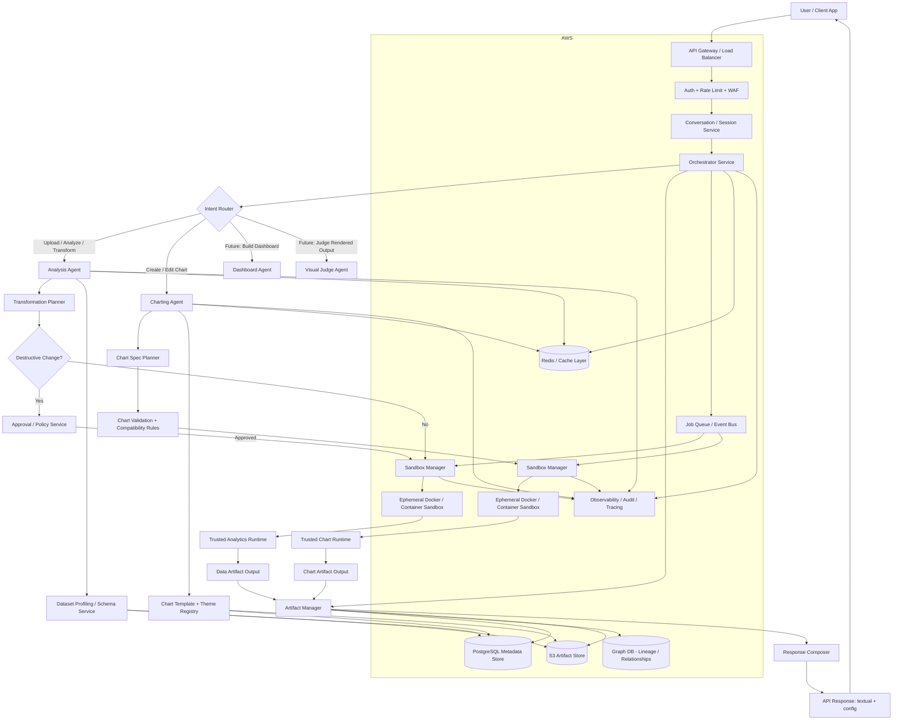
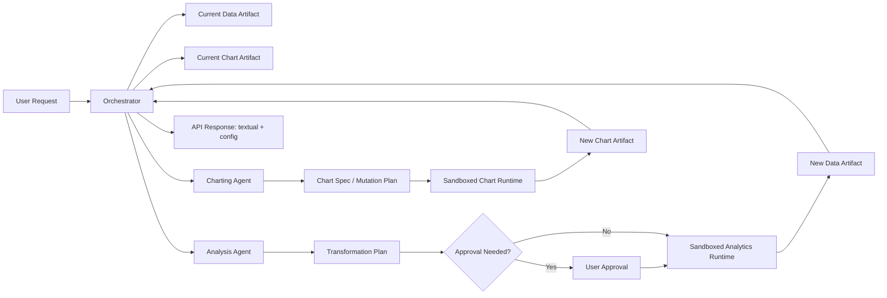

Absolutely — and your concern about sandbox security is valid.

If this is meant for millions of users, then the system cannot be a simple “LLM + pandas + chart config” pipeline. It has to be a distributed, modular, secure analytics platform with strict separation between:
	•	data artifact manipulation
	•	chart artifact manipulation
	•	orchestration / policy
	•	storage / caching / session state
	•	sandboxed execution

And yes: your idea of 2 agents manipulating 2 artifacts is actually very strong.

That gives you a clean boundary:
	•	Analysis Agent only reads/writes the data artifact
	•	Charting Agent only reads/writes the chart spec artifact
	•	neither directly mutates the other’s internal state
	•	orchestrator controls handoff

That is much safer, more explainable, and easier to scale.

⸻

Refined architectural idea

Core artifacts

1. Data Artifact

Represents the dataset state for a session/version.

Contains things like:
	•	dataset id
	•	original file reference
	•	schema
	•	profiling metadata
	•	transformation log
	•	transformed data reference
	•	sampled views
	•	chart-ready extracts

2. Chart Artifact

Represents the visualization state.

Contains things like:
	•	chart version id
	•	chart type
	•	semantic role mapping
	•	theme
	•	chosen library: Highcharts or Highstock
	•	final config object
	•	mutation history

This is a very good design because:
	•	the analysis agent never edits chart config directly
	•	the charting agent never edits raw data directly
	•	orchestration becomes deterministic
	•	future dashboard agent can consume both artifacts

⸻

Security concern: sandboxing

You are right to worry.

If users upload arbitrary CSV/Excel and request transformations, and your agents run code against those artifacts, then you need strong isolation.

Recommended approach

Use ephemeral container-based execution sandboxes.

Not one giant shared sandbox.

Instead:
	•	each job/session gets isolated execution
	•	sandbox reads only the allowed artifact snapshot
	•	sandbox has no broad network access by default
	•	sandbox is short-lived
	•	sandbox writes only approved outputs
	•	after execution, sandbox is destroyed

That is far safer than a persistent shared environment.

Better than “one sandbox per user forever”

I would recommend:
	•	ephemeral job sandbox for actual execution
	•	session state stored outside sandbox
	•	artifacts persisted in object/database storage
	•	sandbox recreated when needed

So the sandbox is compute-only, not stateful.

That way:
	•	compromise blast radius is tiny
	•	stale state does not leak
	•	autoscaling becomes easier
	•	retries are easier
	•	auditability is better

⸻

Important security principle

Do not let agents freely execute arbitrary generated code without policy checks.

Instead:
	•	orchestrator interprets request
	•	converts it into approved operation plan
	•	sandbox executes from a controlled tool library
	•	not arbitrary shell/python unless explicitly allowed internally

So rather than:
	•	“LLM writes pandas code and runs it directly”

prefer:
	•	“LLM outputs structured transform plan”
	•	“trusted execution engine applies plan”

Example structured plan:

{
  "operations": [
    {"type": "drop_nulls", "columns": ["revenue"]},
    {"type": "groupby", "by": ["region"], "metrics": [{"column": "sales", "agg": "sum"}]}
  ]
}

Then your trusted analytics runtime executes that plan.

This is much safer.

⸻

Scalable system design

For millions of users, the architecture should be service-oriented, event-driven where useful, and horizontally scalable.

Main platform building blocks

User-facing layer
	•	Web UI / Chat UI
	•	Public API Gateway

Application layer
	•	Auth service
	•	Session service
	•	Orchestrator service
	•	Policy/approval service

Agent layer
	•	Analysis Agent service
	•	Charting Agent service
	•	later: Dashboard Agent
	•	later: Visual Judge Agent

Execution layer
	•	sandbox manager
	•	job queue
	•	ephemeral containers
	•	artifact loaders/savers

Data/storage layer
	•	PostgreSQL
	•	Graph DB
	•	S3
	•	Redis/cache
	•	observability/logs

Infra layer
	•	AWS EKS / ECS
	•	SQS / Kafka
	•	Lambda for lightweight async tasks
	•	CloudWatch / OpenTelemetry
	•	IAM / KMS / VPC / WAF

⸻

Why PostgreSQL + Graph DB + S3 all make sense

PostgreSQL

Use for:
	•	users
	•	sessions
	•	dataset metadata
	•	chart metadata
	•	version history
	•	approvals
	•	audit logs
	•	API keys / tenant metadata
	•	structured artifact references

Graph DB

Use for:
	•	conversation-to-artifact relationships
	•	chart lineage
	•	dashboard composition
	•	semantic field relationships
	•	entity linkage across datasets
	•	future knowledge-graph-based reasoning

Example graph relationships:
	•	User → Session
	•	Session → DataArtifact
	•	Session → ChartArtifact
	•	ChartArtifact_v4 → derived_from → ChartArtifact_v3
	•	ChartArtifact → uses_field → revenue
	•	DataArtifact → transformed_from → original_dataset

This becomes very useful later for multi-step conversational editing and provenance.

S3

Use for:
	•	uploaded CSV/Excel/PDF
	•	transformed dataset snapshots
	•	sampled extracts
	•	chart artifact JSON blobs
	•	dashboard specs
	•	render previews later
	•	logs/exports/backup files

S3 should hold the heavy blobs.
Postgres should hold metadata and references.

⸻

Full system flowchart

Below is a full system flowchart in Mermaid.

⸻

Expanded architecture by responsibility

1. API Gateway Layer

Purpose:
	•	route requests
	•	auth
	•	throttling
	•	request size limits
	•	tenant isolation
	•	abuse prevention

AWS options:
	•	API Gateway or ALB
	•	WAF
	•	Cognito or custom auth
	•	rate limiting

2. Session / Conversation Service

Purpose:
	•	maintain session state
	•	know current dataset
	•	know current chart version
	•	know theme preference
	•	know whether follow-up mutates or branches

This service should not store giant artifacts directly.
It should store references.

3. Orchestrator Service

This is the brain of the system.

Responsibilities:
	•	understand user intent
	•	choose analysis vs charting vs mutation flow
	•	enforce policy
	•	fetch the right artifact versions
	•	coordinate sandbox execution
	•	build final response

This is where your LLM-based orchestration lives.

4. Artifact Manager

This is one of the most important services.

Responsibilities:
	•	create artifact IDs
	•	store versions
	•	track lineage
	•	retrieve current version
	•	resolve session state
	•	persist metadata in Postgres
	•	persist blobs in S3
	•	persist relationships in Graph DB

This gives you reproducibility and audit.

⸻

Best design for the 2-agent artifact model

Here is the cleanest structure.

Analysis Agent

Input:
	•	user request
	•	current data artifact reference
	•	session context
	•	policy constraints

Output:
	•	proposed transformation plan
	•	optional approval request
	•	updated data artifact
	•	textual summary

It manipulates only:
	•	data artifact

It never edits:
	•	chart config directly

Charting Agent

Input:
	•	user request
	•	current data artifact reference
	•	current chart artifact reference if editing
	•	theme preferences

Output:
	•	semantic chart spec
	•	updated chart artifact
	•	textual summary
	•	final Highcharts/Highstock config

It manipulates only:
	•	chart artifact

It never edits:
	•	raw dataset directly

This separation is excellent.

⸻

But one subtle issue

Sometimes the charting request implies data preparation.

Example:
	•	“create top 10 products by sales bar chart”
	•	“make monthly stock chart”
	•	“show average revenue by region”

These require aggregation or filtering.

So the charting agent should not do the data manipulation itself.
Instead it should ask orchestrator for a derived chart-ready data artifact from analysis.

So the flow becomes:
	1.	user asks for chart
	2.	charting agent realizes chart-ready slice is missing
	3.	charting agent requests analysis operation
	4.	analysis agent creates derived data artifact
	5.	charting agent consumes that artifact and builds config

That preserves clean boundaries.

⸻

Recommended scalable deployment model on AWS

For millions of users, I would recommend something like this:

Compute
	•	EKS if you want maximum flexibility and multi-service orchestration
	•	ECS Fargate if you want simpler container operations
	•	sandbox workers can run as isolated jobs or short-lived tasks

Storage
	•	S3 for file/blob artifacts
	•	RDS PostgreSQL / Aurora PostgreSQL for relational metadata
	•	Neptune or another managed graph database for artifact lineage / semantic graph
	•	ElastiCache Redis for caching

Queueing / async
	•	SQS for job dispatch
	•	optionally SNS/EventBridge for events
	•	optionally Kafka/MSK if event traffic becomes very large and complex

Security
	•	VPC private subnets
	•	IAM roles per service
	•	KMS encryption
	•	WAF
	•	Secrets Manager
	•	no public DBs
	•	egress restrictions on sandboxes
	•	image scanning for containers

Observability
	•	CloudWatch
	•	OpenTelemetry
	•	centralized audit logs
	•	tracing across orchestrator, agents, sandboxes

⸻

Sandbox security recommendations

Your instinct about Docker is correct, but Docker alone is not enough.

For safe execution, the sandbox should have:

Isolation controls
	•	ephemeral filesystem
	•	CPU/memory/time limits
	•	no privilege escalation
	•	read-only base image
	•	network disabled or tightly restricted
	•	no shared writable volume except job scratch
	•	no host mounts
	•	no docker-in-docker
	•	no package install at runtime if possible

Execution controls
	•	only approved toolset available
	•	whitelist allowed libraries
	•	output size limits
	•	file count limits
	•	timeout-based termination
	•	explicit artifact input/output paths

Lifecycle
	•	create sandbox for job
	•	mount only job inputs
	•	run task
	•	collect outputs
	•	destroy sandbox

Additional hardening
	•	seccomp/apparmor
	•	non-root user
	•	signed container images
	•	vulnerability-scanned images
	•	malware scanning on uploads
	•	spreadsheet formula/macro handling carefully

Especially for Excel and CSV uploads, treat files as untrusted.

⸻

Important security warning for Excel/PDF inputs

If later you accept Excel/PDF and maybe render or parse them, you need protections against:
	•	malicious macros
	•	formula injection
	•	zip bombs
	•	parser exploits
	•	huge memory payloads
	•	path traversal in archive-like files

So the ingestion pipeline should include:
	•	MIME/type validation
	•	size limits
	•	parser isolation
	•	antivirus or malware scanning
	•	normalization before use
	•	macro stripping or rejection where needed

⸻

Better than “agents writing arbitrary code”

For production, the safest architecture is:

LLM outputs structured plans

Examples:
	•	transform plan JSON
	•	chart spec JSON
	•	mutation patch JSON

Trusted runtimes execute them

Examples:
	•	pandas/polars execution runtime
	•	chart config builder runtime
	•	config validator runtime

This makes the product:
	•	safer
	•	testable
	•	deterministic
	•	cheaper to operate
	•	less hallucination-prone

⸻

Scalable request flow

Here is the practical high-scale path.

Synchronous path for fast jobs

Used for:
	•	small datasets
	•	quick chart edits
	•	simple config generation

Flow:
	•	API call
	•	orchestrator
	•	artifact fetch
	•	lightweight sandbox execution
	•	response in-line

Asynchronous path for heavy jobs

Used for:
	•	huge files
	•	dashboard generation
	•	deep profiling
	•	PDF extraction later
	•	long-running visual critique

Flow:
	•	API call
	•	create job
	•	push to queue
	•	worker picks up
	•	outputs stored
	•	client polls or subscribes

For millions of users, you need both.

⸻

Recommended artifact versioning model

Data artifact lineage
	•	data_v0 = original upload
	•	data_v1 = null handling approved
	•	data_v2 = grouped by month
	•	data_v3 = filtered top 10 categories

Chart artifact lineage
	•	chart_v0 = initial recommendation
	•	chart_v1 = palette changed
	•	chart_v2 = x/y swapped
	•	chart_v3 = line changed to stock
	•	chart_v4 = title/theme updated

This is perfect for:
	•	auditability
	•	undo/redo
	•	explainability
	•	collaborative future product features

Graph DB is very helpful here.

⸻

Future VLM agent placement

Your future multimodal/VLM judge fits well as a post-render feedback loop.

Future flow
	1.	chart config generated
	2.	UI renders preview
	3.	preview image passed to visual judge
	4.	judge returns suggestions:
	•	reduce label density
	•	rotate category labels
	•	enlarge margins
	•	switch to horizontal bars
	•	use fewer series
	5.	charting agent applies safe patch
	6.	new chart version created

So that agent should not replace charting.
It should act as a:
	•	critic
	•	evaluator
	•	layout improver
	•	dashboard arranger

⸻

Suggested technology stack

Core backend
	•	FastAPI for API layer
	•	LangGraph or custom orchestrator for agent workflows
	•	Pydantic for contracts
	•	pandas or polars for data manipulation
	•	Highcharts/Highstock JSON template registry
	•	PostgreSQL / Aurora PostgreSQL
	•	Graph DB like Neptune
	•	S3 for artifacts
	•	Redis for cache
	•	SQS/EventBridge for async jobs

Container/execution
	•	Docker images for execution runtimes
	•	ECS/EKS for orchestration
	•	short-lived job containers
	•	hardened worker images

AWS security/infrastructure
	•	VPC
	•	IAM
	•	KMS
	•	Secrets Manager
	•	WAF
	•	CloudWatch
	•	OpenTelemetry

⸻

Final design principle I recommend

Your platform should be built around this contract:

Agents do not manipulate raw user environment. They manipulate versioned artifacts through policy-controlled runtimes inside ephemeral sandboxes.

That is the secure and scalable way to think about it.

⸻

One more flowchart: agent + artifact interaction

This one is more specific to your 2-agent design.

⸻

My recommendation on the sandbox concern

Do not create one long-lived sandbox per session.

Better:
	•	keep session state in Postgres/S3/GraphDB
	•	create short-lived container jobs per operation
	•	destroy them after completion

That gives you:
	•	stronger isolation
	•	lower security risk
	•	easier autoscaling
	•	more predictable cost
	•	better resilience

⸻

Next step should be to turn this into a repository-level system blueprint with:
	•	services
	•	folders
	•	DB schema
	•	artifact schema
	•	queue/job model
	•	sandbox lifecycle
	•	and exact request/response contracts.

Below is a detailed end-to-end Mermaid flowchart for the architecture we settled on:
	•	one orchestrator
	•	analytics runtime
	•	chart runtime
	•	explicit state
	•	DatasetState
	•	ViewState
	•	ChartState
	•	future-ready for:
	•	dashboarding
	•	async heavy jobs
	•	approvals
	•	history/versioning
	•	public API

I’ll first give the full flowchart, then explain it layer by layer.

flowchart TD

    %% =========================================================
    %% ENTRY LAYER
    %% =========================================================
    U[User / Client App Chat UI or Public API Consumer]
    API[API Gateway / FastAPI Layer Auth - Validation - Rate Limits - Request IDs]
    U --> API

    %% =========================================================
    %% SESSION + REQUEST CONTEXT
    %% =========================================================
    API --> RC[Request Context Builder Build request envelope from message, files, session_id, chart_id]
    RC --> SS[Session State Loader Load active dataset/view/chart ids, preferences, pending approvals]
    SS --> ORCH[Orchestrator Central control brain]

    %% =========================================================
    %% STATE STORES
    %% =========================================================
    SS --> REDIS[(Fast State Cache Redis / in-memory)]
    SS --> PG[(PostgreSQL Durable session + version metadata)]
    SS --> OBJ[(Object Store S3 / blobs / configs / prepared views)]

    %% =========================================================
    %% ORCHESTRATOR DECISION LAYER
    %% =========================================================
    ORCH --> IR[Intent Resolver Classify request type]
    IR --> DEC{Request Type?}

    DEC -->|Analyze dataset| ANALYZE_PATH
    DEC -->|Create chart| CREATE_PATH
    DEC -->|Edit chart| EDIT_PATH
    DEC -->|Use older version / revert| REVERT_PATH
    DEC -->|Heavy deep analysis| ASYNC_PATH
    DEC -->|Future: build or edit dashboard| DASHBOARD_PATH

    %% =========================================================
    %% KNOWLEDGE + TOOLING FOR ORCHESTRATOR
    %% =========================================================
    ORCH --> TOOLSET[Reasoning Toolset]
    TOOLSET --> SEM[Semantic Property Lookup Tool GraphRAG-like property retrieval]
    TOOLSET --> EXA[Exact Property Graph Lookup Fast exact property resolution]
    TOOLSET --> EG[Example Retrieval Tool Similar chart config examples]
    TOOLSET --> PROF[Schema/Profile Summary Access Column names, types, describe, sample summaries]

    %% =========================================================
    %% ANALYZE DATASET PATH
    %% =========================================================
    subgraph ANALYZE_PATH [Analyze Dataset Path]
        A1[Load DatasetState]
        A2[Dataset Profiling Planner Determine what summary/analysis is needed]
        A3[Analytics Runtime]
        A4[Build/Refresh Dataset Profile types, nulls, date candidates, numeric candidates, dimensions, measures]
        A5[Persist DatasetState updates]
        A6[Textual Response Builder insights / issues / suggestions]

        A1 --> A2 --> A3 --> A4 --> A5 --> A6
    end

    %% =========================================================
    %% CREATE CHART PATH
    %% =========================================================
    subgraph CREATE_PATH [Create Chart Path]
        C1[Load Active DatasetState]
        C2[Chart Request Planner Understand chart goal, field roles, family, style]
        C3{Does request require data preparation?}
        C4[Build Analytics Plan type normalization, null policy, grouping, resampling, filtering]
        C5{Destructive transformation required?}
        C6[Approval Manager Ask user before destructive changes]
        C7[Analytics Runtime]
        C8[Create ViewState chart-ready rows / grouped / resampled / filtered data]
        C9[Chart Spec Planner semantic chart spec + bindings + theme]
        C10[Chart Runtime deterministically bind real data into config]
        C11[Validate Chart Output schema, roles, options, data compatibility]
        C12[Persist ViewState + ChartState]
        C13[Response Builder textual + config + ids]

        C1 --> C2 --> C3
        C3 -->|Yes| C4
        C3 -->|No| C9
        C4 --> C5
        C5 -->|Yes| C6
        C5 -->|No| C7
        C6 -->|Approved| C7
        C6 -->|Rejected| C13
        C7 --> C8 --> C9 --> C10 --> C11 --> C12 --> C13
    end

    %% =========================================================
    %% EDIT CHART PATH
    %% =========================================================
    subgraph EDIT_PATH [Edit Chart Path]
        E1[Load Active ChartState + ViewState + DatasetState]
        E2[Edit Intent Planner Interpret user edit request]
        E3{Edit Type?}
        E4[Visual-only Edit theme, title, legend, tooltip, colors]
        E5[Semantic Chart Edit swap axes, change chart type, change field roles]
        E6[Data-affecting Edit new grouping, new filter, use original data]
        E7[Update Chart Spec]
        E8[Build New Analytics Plan]
        E9{Approval needed?}
        E10[Approval Manager]
        E11[Analytics Runtime]
        E12[Create New ViewState]
        E13[Chart Runtime]
        E14[Validate New Chart]
        E15[Persist New ChartState and possibly new ViewState]
        E16[Response Builder]

        E1 --> E2 --> E3
        E3 -->|Visual-only| E4 --> E7
        E3 -->|Semantic edit| E5 --> E7
        E3 -->|Data-affecting| E6 --> E8
        E8 --> E9
        E9 -->|Yes| E10
        E9 -->|No| E11
        E10 -->|Approved| E11
        E10 -->|Rejected| E16
        E11 --> E12 --> E7
        E7 --> E13 --> E14 --> E15 --> E16
    end

    %% =========================================================
    %% REVERT / VERSION PATH
    %% =========================================================
    subgraph REVERT_PATH [Revert / Version Navigation Path]
        R1[Load Session History + Active Version Pointers]
        R2[Version Resolver find target dataset/view/chart version]
        R3{Revert what?}
        R4[Revert DatasetState]
        R5[Revert ViewState]
        R6[Revert ChartState]
        R7[If needed regenerate downstream states]
        R8[Persist new active pointers]
        R9[Response Builder]

        R1 --> R2 --> R3
        R3 -->|Dataset| R4 --> R7
        R3 -->|View| R5 --> R7
        R3 -->|Chart| R6 --> R8
        R7 --> R8 --> R9
    end

    %% =========================================================
    %% HEAVY / ASYNC PATH
    %% =========================================================
    subgraph ASYNC_PATH [Heavy Deep Analysis / Async Path]
        H1[Heavy Request Detector large files, complex transformations, multi-step analysis]
        H2[Create Job Record]
        H3[Push to Queue]
        H4[Worker Picks Job]
        H5[Analytics Runtime / Future Advanced Analysis Runtime]
        H6[Persist outputs to DatasetState/ViewState/ChartState]
        H7[Job Status Updater]
        H8[Client polls or receives job completion]

        H1 --> H2 --> H3 --> H4 --> H5 --> H6 --> H7 --> H8
    end

    %% =========================================================
    %% FUTURE DASHBOARD PATH
    %% =========================================================
    subgraph DASHBOARD_PATH [Future Dashboard Path]
        D1[Load relevant DatasetState / ViewStates / ChartStates]
        D2[Dashboard Planner determine widgets, layout, filters, interactions]
        D3[Need new widget views?]
        D4[Analytics Runtime creates additional ViewStates]
        D5[Chart Runtime creates or updates widget charts]
        D6[Dashboard Runtime compose widgets + layout + interactions]
        D7[Persist DashboardState]
        D8[Response Builder]

        D1 --> D2 --> D3
        D3 -->|Yes| D4 --> D5 --> D6 --> D7 --> D8
        D3 -->|No| D5 --> D6 --> D7 --> D8
    end

    %% =========================================================
    %% ANALYTICS RUNTIME INTERNALS
    %% =========================================================
    subgraph ANALYTICS_RUNTIME [Analytics Runtime Internals]
        AR1[Load source dataset from DatasetState]
        AR2[Normalize types dates, numerics, categoricals]
        AR3[Apply approved transformations filter, groupby, aggregate, resample, top-N, null policy]
        AR4[Build chart-ready table]
        AR5[Store prepared data as ViewState blob]
        AR1 --> AR2 --> AR3 --> AR4 --> AR5
    end

    %% =========================================================
    %% CHART RUNTIME INTERNALS
    %% =========================================================
    subgraph CHART_RUNTIME [Chart Runtime Internals]
        CR1[Load semantic chart spec]
        CR2[Load ViewState]
        CR3[Resolve template Highcharts or Highstock]
        CR4[Bind real data series, categories, timestamps, grouping]
        CR5[Apply theme/style pack]
        CR6[Validate options object]
        CR7[Store final ChartState]
        CR1 --> CR2 --> CR3 --> CR4 --> CR5 --> CR6 --> CR7
    end

    %% =========================================================
    %% STATE MODEL
    %% =========================================================
    subgraph STATE_MODEL [Persisted State Model]
        DS[DatasetState source file, schema, profile, lineage]
        VS[ViewState chart-ready prepared data]
        CS[ChartState semantic spec + final config + lineage]
        PREF[Preference Summary theme, approval rules, chart style habits]
        HIST[Session Summary + Version Pointers]
    end

    %% =========================================================
    %% PERSISTENCE LINKS
    %% =========================================================
    A5 --> DS
    C8 --> VS
    C12 --> VS
    C12 --> CS
    E12 --> VS
    E15 --> VS
    E15 --> CS
    R8 --> HIST
    SS --> PREF
    SS --> HIST

    %% =========================================================
    %% INTERNAL RUNTIME CALLS
    %% =========================================================
    C7 -. executes .-> ANALYTICS_RUNTIME
    E11 -. executes .-> ANALYTICS_RUNTIME
    A3 -. executes .-> ANALYTICS_RUNTIME

    C10 -. executes .-> CHART_RUNTIME
    E13 -. executes .-> CHART_RUNTIME
    D5 -. executes .-> CHART_RUNTIME

    %% =========================================================
    %% RESPONSE EXIT
    %% =========================================================
    A6 --> OUT[Final API Response textual + config + ids/status]
    C13 --> OUT
    E16 --> OUT
    R9 --> OUT
    D8 --> OUT
    H8 --> OUT
    OUT --> API
    API --> U

How to read this diagram

This diagram is organized around the real life of a request, not just the code modules.

The system starts with the user request, then moves through:
	•	request context
	•	session/state loading
	•	orchestration
	•	one of several possible paths
	•	deterministic execution
	•	state persistence
	•	response building

The most important idea is that every request does not go through the same path. The orchestrator first decides what kind of request it is, then chooses the correct route.

⸻

1. Entry layer

The user can come from:
	•	your own chat UI
	•	a public API consumer
	•	later maybe an internal dashboard builder UI

The API layer handles:
	•	auth
	•	validation
	•	request ids
	•	rate limiting
	•	envelope shaping

Then the request context builder gathers the request into a normalized input:
	•	message
	•	session id
	•	uploaded files
	•	chart id if relevant
	•	dashboard id later if relevant

This normalized request is passed to the session state loader.

⸻

2. Session and state loading

Before the system reasons deeply, it loads the active state:
	•	active dataset id
	•	active view id
	•	active chart id
	•	user preferences
	•	pending approvals
	•	version pointers

This is very important because it avoids reconstructing state from raw conversation history every turn.

The session loader can use:
	•	Redis for fast hot-path state
	•	Postgres for durable truth
	•	S3/object store for heavier blobs like view files and final configs

This keeps history support from becoming too expensive.

⸻

3. Orchestrator and intent resolution

The orchestrator is the central control brain.

Its job is to answer:
	•	what is this request actually asking for
	•	what objects are being referred to
	•	which workflow should run
	•	whether approval is needed
	•	whether this should run synchronously or asynchronously

The intent resolver classifies the request into one of the main categories:
	•	analyze dataset
	•	create chart
	•	edit chart
	•	revert or use older version
	•	heavy deep analysis
	•	future dashboard operations

This is the main branching point in the architecture.

⸻

4. Knowledge and reasoning toolset

The orchestrator can use your existing strengths here:
	•	semantic property lookup
	•	exact property graph lookup
	•	example retrieval
	•	schema/profile access

This is the place where your current POC remains valuable.

The orchestrator uses these tools to improve reasoning, but it still does not generate final trustworthy config by itself.

That responsibility is delegated to deterministic runtimes later.

⸻

5. Analyze dataset path

This path is for requests like:
	•	“What is in this dataset?”
	•	“What columns are useful?”
	•	“Give me insights.”

The flow is:
	1.	load current dataset state
	2.	plan what kind of profiling/analysis is needed
	3.	run analytics runtime
	4.	refresh or build dataset profile
	5.	persist dataset state updates
	6.	return a textual summary

This path is important because later “analyst mode” or “deep analysis” builds on the same logic.

⸻

6. Create chart path

This is the most important current path.

It works like this:

Step C1–C2

Load active dataset and understand the chart request:
	•	what chart type
	•	what fields
	•	what theme
	•	what family: Highcharts or Highstock

Step C3

Decide whether data preparation is needed.

Sometimes it is not:
	•	maybe the data is already clean
	•	maybe the current view is enough

Sometimes it is:
	•	dates need conversion
	•	nulls need handling
	•	grouping or filtering is required

Step C4–C8

If data prep is needed:
	•	create analytics plan
	•	check if destructive
	•	ask approval if necessary
	•	run analytics runtime
	•	create a ViewState

This ViewState is the chart-ready prepared data.

Step C9–C11

Then:
	•	chart spec planner creates semantic chart intent
	•	chart runtime binds actual data into config
	•	validator confirms correctness

Step C12–C13

Persist:
	•	new view
	•	new chart
	•	build final response

This path is the heart of the architecture.

⸻

7. Edit chart path

This is for follow-ups like:
	•	“swap axes”
	•	“change to stock chart”
	•	“make it darker”
	•	“use original data”
	•	“group by month instead”

The key point is: not all edits are the same.

The diagram separates them into:

Visual-only edit

Things like:
	•	title
	•	legend
	•	colors
	•	theme
	•	tooltip

These usually do not require data changes.

Semantic chart edit

Things like:
	•	swap axes
	•	change chart type
	•	map a different field

These may or may not require data changes.

Data-affecting edit

Things like:
	•	use original data
	•	regroup by month
	•	apply top-N
	•	filter rows

These require a new analytics pass and often a new ViewState.

This distinction is why the architecture is reliable:
the system does not blindly regenerate everything or blindly mutate strings.

It checks what kind of edit is required and takes the correct path.

⸻

8. Revert and version path

This supports requests like:
	•	“use original data”
	•	“go back to the previous chart”
	•	“revert to before null removal”

The system:
	1.	loads session history and version pointers
	2.	resolves the target version
	3.	decides whether dataset, view, or chart is being reverted
	4.	regenerates downstream state if needed
	5.	updates active pointers
	6.	returns a response

This is why explicit state matters so much. Without state objects and version pointers, revert behavior becomes very unreliable.

⸻

9. Heavy / async path

Some requests should not stay on the synchronous hot path.

Examples:
	•	very large files
	•	deep multi-step analysis
	•	future dashboard generation
	•	expensive resampling/grouping chains

For those:
	1.	create job record
	2.	push to queue
	3.	worker executes
	4.	persist outputs
	5.	update status
	6.	client polls or gets notified later

This keeps the normal chat experience fast while still allowing heavy work.

⸻

10. Future dashboard path

This is shown in the diagram to make the architecture future-ready.

Later, the system can add:
	•	DashboardState
	•	dashboard planner
	•	dashboard runtime

The path becomes:
	1.	load relevant datasets, views, charts
	2.	dashboard planner decides widgets/layout/filters
	3.	analytics runtime creates additional views if needed
	4.	chart runtime builds widget charts
	5.	dashboard runtime composes layout and interactions
	6.	persist dashboard
	7.	return response

This proves that the architecture does not need a rewrite for dashboard editing later. It needs an added composition layer.

⸻

11. Analytics runtime internals

The analytics runtime itself has its own internal flow:
	1.	load source dataset
	2.	normalize types
	3.	apply approved transformations
	4.	build chart-ready table
	5.	store prepared output as ViewState

This is where:
	•	string dates become real datetimes/timestamps
	•	numeric strings become numeric values
	•	null policies are applied
	•	resampling/grouping happens
	•	chart-ready rows are produced

This runtime is deterministic because accuracy matters.

⸻

12. Chart runtime internals

The chart runtime also has a structured internal flow:
	1.	load semantic chart spec
	2.	load ViewState
	3.	choose template (Highcharts or Highstock)
	4.	bind actual data
	5.	apply theme/style
	6.	validate options
	7.	store final ChartState

This is where the system fixes the biggest weakness of the original POC:
the LLM no longer serializes the final config as a fragile string blob.

Instead, deterministic code builds the final config object.

⸻

13. Persisted state model

The diagram shows the three current core states:

DatasetState

Represents the source dataset context:
	•	upload
	•	schema
	•	profile
	•	lineage

ViewState

Represents the prepared chart-ready data:
	•	transformed rows
	•	grouped/resampled rows
	•	columns used
	•	row count
	•	storage reference

ChartState

Represents the actual chart:
	•	semantic chart spec
	•	final config
	•	version lineage

It also shows:
	•	preference summary
	•	session/version pointers

These give the system continuity without making the LLM remember everything.

⸻

14. Why this flow is strong

This detailed flow is strong because it separates concerns very clearly:

The orchestrator decides what should happen.
The analytics runtime decides what the data should look like.
The chart runtime decides how the chart should be built exactly.
The state layer remembers what currently exists and what existed before.

That means:
	•	low risk of config hallucination
	•	strong edit support
	•	safe history/versioning
	•	future dashboard extensibility
	•	good API readiness

⸻

15. How future changes fit into this flow

This same architecture can grow without a rewrite.

Deep analysis later

Extend the analytics path and async path.

Dashboard editing later

Add dashboard planner/runtime/state on top of chart and view objects.

Visual judge later

Insert a post-chart or post-dashboard review step after runtime execution.

More chart families later

Add more templates and runtime translators while keeping semantic chart specs stable.

So the diagram is current and future-aware at the same time.

⸻

16. Practical takeaway

If you implement this architecture carefully, the product will feel like:
	•	one coherent conversational analyst

while internally it will behave like:
	•	a controlled pipeline of reasoning, preparation, rendering, and memory.

That is exactly the right structure for:
	•	reliability now
	•	dashboarding later
	•	public API eventually
	•	and scale in the long run.

If you want, the next step I’d recommend is a second Mermaid diagram that is more implementation-oriented, showing:
	•	services
	•	DB/storage boundaries
	•	APIs
	•	workers
	•	and runtime contracts.