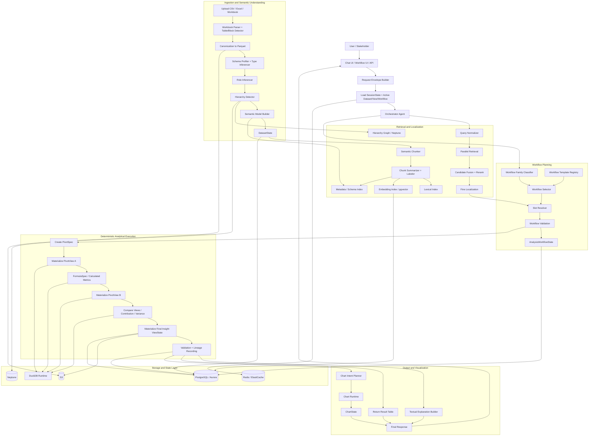

# Updated Solution for Structured Business Analytics

## 1. Executive Summary

This project aims to build a **trustworthy AI system for business analytics over complex structured data**, especially data that users currently analyze through **Excel pivot tables, filters, formulas, and repeated drill-down workflows**.

The core insight is that users are usually not asking for a single row lookup or a single chart. They are trying to answer business questions such as:

- Why are sales weak in a specific region?
- Which product categories are driving a decline?
- How does current performance compare with prior periods or internal targets?
- Which hierarchy level should be drilled into next to explain a business outcome?

In practice, users answer such questions manually by:

1. starting from a large base business table,
2. creating one or more pivot tables,
3. applying filters,
4. changing hierarchy levels,
5. computing formulas such as growth, variance, or contribution,
6. comparing multiple pivot outputs,
7. and then deriving an insight.

The proposed solution is to build an **AI-driven analytical workflow engine** that can reproduce and automate this process in a structured, controllable, and scalable way.

The system will be built around a **single user-facing orchestrator** that interprets the user request, selects the right analytical workflow template, resolves the relevant fields and hierarchies, executes deterministic analytical operators, and returns a trustworthy analytical result. That result may then be shown directly to the user as a structured table or passed to a downstream visualization layer.

A key design decision is that the system should not rely on unrestricted free-form reasoning for computation. Instead, it should use:

- a **semantic model of the data**
- **workflow templates represented as parameterized DAGs**
- **typed operators for deterministic execution**
- **explicit state objects** to preserve continuity and lineage
- and **optional charting** only after the analytical result has been materialized

This makes the solution:

- more reliable than open-ended agentic reasoning
- easier to validate with stakeholders
- easier to explain and debug
- compatible with enterprise workflows
- and extensible toward dashboards, saved workflows, and agent-to-agent interoperability later

The most important product-level idea is that the system should evolve from being a simple “analytics chatbot” into a **workflow-aware business analysis engine**. Instead of answering one query at a time in isolation, it should be capable of selecting and executing a known family of analytical workflows, similar in spirit to how business users repeatedly use pivot tables and formula-driven analysis in spreadsheet tools.

In the near term, the system should focus on:

- stakeholder-approved workflow families
- high-confidence execution over hierarchical and pivot-driven data
- deterministic result tables
- and explainable outputs

In the longer term, it can evolve into:

- a saved workflow platform
- a dashboard-building system
- a reusable analytical agent exposed over API, MCP, or A2A
- and a representation-adaptive reasoning engine that can choose whether to operate over flat tables, pivot-like representations, or hierarchical graph/tree structures

---

## 2. Problem Framing and Design Goals

### 2.1 What problem are we actually solving?

The surface-level framing of the project might sound like:

- “build a chatbot for tables”
- “build an analytics agent”
- or “build chart generation from data”

But these descriptions are incomplete.

The real problem is:

> **How do we convert vague business analysis intent into trustworthy, executable analytical workflows over structured enterprise data?**

Users do not fundamentally want:

- SQL
- raw tables
- schema exploration
- retrieval pipelines
- or charts

They want:

- a correct answer
- supported by the right slice of data
- in the right analytical form
- with enough trust to act on it

In current business practice, this often happens through spreadsheet workflows rather than direct database querying. A user starts from a large denormalized table and iteratively performs analysis through pivot tables, filters, formulas, and drill-downs. The system we are designing must automate that workflow rather than merely simulate table Q&A.

So the correct problem framing is:

> **Build a semantic analytical layer over structured business data that can understand user intent, localize the right evidence, execute the right workflow, and return a trustworthy analytical result.**

---

### 2.2 Why generic table QA is not enough

Most generic table-question-answering systems assume a simpler problem:

- identify relevant rows or cells
- maybe do a small computation
- then return an answer

That is insufficient for real stakeholder workflows because business analysis usually requires:

- multiple hierarchy levels
- aggregation over measures
- repeated pivoting
- post-aggregation formulas
- comparisons across several generated views
- and interpretation of the resulting patterns

For example, a stakeholder question such as:

> “Why are sales weaker this quarter in the West, and is it due to product mix or margin compression?”

is not answerable from a single cell, or even one grouped table. It often requires a sequence such as:

1. create a pivot of sales by region and quarter
2. identify the weakest region
3. create a pivot of category performance within that region
4. create another pivot of margin by state or product group
5. compute variance or contribution metrics
6. compare outputs
7. and then derive an insight

This means the system must support **analytical workflows**, not just retrieval and answering.

---

### 2.3 Core design stance

The solution should be built around the following design stance:

> **LLMs should interpret, classify, route, and explain. Deterministic operators should compute.**

This is one of the most important choices in the project.

The LLM should be responsible for:

- understanding the user’s question
- identifying likely workflow families
- selecting and parameterizing a suitable DAG template
- resolving business terminology to semantic data concepts
- and producing an explanation of the result

The deterministic system should be responsible for:

- applying filters
- materializing pivots
- computing formulas
- ranking and comparing results
- preserving lineage
- and returning the final analytical table

This division improves:

- correctness
- reproducibility
- theoretical defensibility
- debuggability
- and stakeholder trust

---

### 2.4 Why workflow templates are central

A central insight in the updated solution is that many stakeholder questions are not unique. They are members of recurring **analytical workflow families**.

Examples include:

- sales diagnosis
- product mix decline analysis
- variance vs prior period
- contribution analysis
- weak-region drill-down
- margin compression analysis
- top-N within hierarchy
- plan vs actual analysis

Instead of forcing the system to invent a reasoning process every time, we can encode these families as **parameterized DAG workflows**.

This has several benefits:

- improved reliability
- easier stakeholder validation
- easier UI customization
- easier testing
- and better long-term productization

These workflow DAGs can be dynamically selected based on:

- the user query
- the semantic model of the dataset
- the available hierarchies and measures
- and later the user’s saved organization-specific templates

This means the system becomes more like a **workflow-aware analytical assistant** than a generic conversational model.

---

### 2.5 Why explicit semantic modeling is required

The system cannot operate directly on raw rows and columns if it wants to support pivot-style analysis.

It must first build an understanding of the dataset, including:

- which fields are measures
- which are dimensions
- which are time fields
- which hierarchies exist
- what the data granularity is
- and whether the structure is flat, hierarchical, pivot-like, or mixed

This semantic model is essential because it allows the planner to answer questions like:

- what hierarchy can be drilled into
- what measure should be aggregated
- which time grain is appropriate
- what filter context is implied
- which workflow templates are compatible with the dataset

Without semantic modeling, workflow selection becomes brittle and overly dependent on raw column names.

---

### 2.6 Why the result table should be the truth object

The final analytical result should almost always be a **structured table**, even when the user eventually wants a chart.

That means the product should treat the result table as the central truth object of the workflow.

Why this matters:

- it is easier to validate than a chart
- it provides a reusable artifact for follow-ups
- it can be shown directly to users
- it can be stored with lineage and versioning
- and it cleanly separates analytics from visualization

So the system should generally follow this flow:

1. user asks a business question
2. system selects and executes an analytical workflow
3. system materializes a result table
4. system returns that table
5. and only then optionally generates a chart or dashboard component from it

This design significantly reduces visualization-driven errors and improves trust.

---

### 2.7 Design goals

The updated solution should be designed to satisfy the following goals.

#### Goal 1: Trustworthy analytical execution
The system must produce answers that are grounded in deterministic, inspectable computation rather than open-ended LLM generation.

#### Goal 2: Workflow-awareness
The system should support multi-step business analysis workflows, not only isolated question-answer pairs.

#### Goal 3: Pivot-table compatibility
The system should align with how stakeholders actually analyze data today: through pivots, hierarchies, filters, and formulas.

#### Goal 4: Semantic adaptability
The system should be able to understand whether a dataset is flat, hierarchical, pivot-like, or mixed, and use the right analytical strategy.

#### Goal 5: Explainability and lineage
Every result should be explainable in terms of:
- source data
- selected workflow
- applied filters
- pivots created
- formulas computed
- and intermediate views

#### Goal 6: Product scalability
The system should not depend on hand-coded logic for every question phrasing. It should scale through reusable workflow families, typed slots, and saved/customized templates.

#### Goal 7: UI and platform extensibility
The solution should support future evolution into:
- editable workflow templates
- charting and dashboard generation
- saved organizational workflows
- and external interoperability via API, MCP, or A2A

---

### 2.8 Immediate design implication

The practical implication of all of the above is that the project should be treated as:

> **a workflow-driven business analytics system with semantic understanding and deterministic execution**

not merely as:

- a table RAG system
- a charting assistant
- or a generic agent over spreadsheets

This framing should guide all future design decisions, including:

- the architecture
- the workflow registry
- the state model
- the operator library
- the front-end workflow customization layer
- and the testing strategy

---

### 2.9 Summary of the updated design direction

The updated solution should therefore be built around the following principle:

> **Translate stakeholder business questions into validated, parameterized analytical workflows over semantically understood data, execute those workflows deterministically, and return reusable analytical tables that may optionally be visualized.**

That is the foundation for the full project.

---

## 3. Research Novelty and Positioning

### 3.1 Why this should not be framed as a simple fusion of existing papers

This project should **not** be positioned as a loose combination of table-retrieval, spreadsheet-reasoning, and agent papers. That would undersell the actual contribution.

The more accurate framing is that this project proposes a **new application architecture for business analytics over structured enterprise data**. The novelty comes from changing the **unit of reasoning** and the **unit of execution**:

- Existing table reasoning work often focuses on **answering one question over one table context**.
- This project focuses on **executing a business-analysis workflow** over a base dataset, often through **multiple pivots, filters, hierarchy traversals, and formulas**, before deriving an insight.

So the key novelty is not simply “better retrieval for tables.”  
It is:

> **a workflow-aware, representation-adaptive analytical reasoning system that compiles stakeholder business questions into validated, parameterized analytical workflows over semantically understood data.**

This is a stronger and more practical formulation for enterprise use.

### 3.2 Research landscape: what prior work contributes

Several recent works are highly relevant, but each addresses only part of the full problem.

#### TableRAG
TableRAG argues that large-table reasoning should first retrieve relevant **schema and cells** rather than inject the entire table into context. This is important because it reinforces a core idea we should keep: **high-recall evidence localization before reasoning**.

#### H-STAR
H-STAR introduces a **column-first, then row extraction** strategy and an adaptive reasoning stage. This is highly relevant because it shows that correct schema localization often matters more than naive full-table prompting.

#### FRTR
FRTR is especially relevant for spreadsheet-like data. Its key contribution is **multi-granular spreadsheet retrieval** through **row, column, and block views**, fused using hybrid retrieval. This is close to the way enterprise spreadsheet analysis really works.

#### BRTR
BRTR extends spreadsheet reasoning by replacing single-pass retrieval with an **iterative agentic retrieval loop**. Its key value for this project is not the exact framework, but the principle that spreadsheet reasoning often needs **progressive narrowing and tool-call traces**, not one-shot retrieval.

#### GraphOTTER
GraphOTTER is highly relevant because it explicitly converts a complex table into a **graph-based representation** and reasons over that representation step by step. This supports our idea that flat tabular storage is not always the best reasoning representation.

#### RealHiTBench / TreeThinker
RealHiTBench demonstrates that hierarchical tables remain hard for current models, while TreeThinker validates the usefulness of **tree-based reasoning over hierarchical headers**. This strongly supports our idea that some datasets should be lifted into **tree or graph structures** before reasoning.

#### ReWOO
ReWOO shows that reasoning and tool interaction can be decoupled to improve token efficiency and system modularity. This supports our idea that the system should not rely on repeated interleaved free-form reasoning when planning analytical workflows.

#### LLMCompiler
LLMCompiler shows that function execution can be organized as a dependency graph and run in parallel, improving latency and efficiency. This is directly useful for our design because analytical workflows can often be represented as DAGs with partially parallel branches.

### 3.3 What is missing in the current research landscape

Even taken together, these papers still leave an important gap:

> **They do not fully solve stakeholder-style business analytics workflows built around pivot tables, formulas, hierarchy changes, repeated drill-downs, and iterative comparison of multiple analytical views.**

In practice, a business analyst does not usually answer one question from one table slice. They more often:

1. start from a large base table,
2. create one pivot,
3. inspect it,
4. create another pivot at a different hierarchy or filter level,
5. compute formulas such as growth, contribution, or variance,
6. compare those views,
7. and then derive an insight.

That workflow pattern is not well captured by standard table-QA or spreadsheet-RAG framing.

### 3.4 The intended novelty of this project

The proposed system introduces novelty in five major ways.

#### Novelty 1: Workflow-first reasoning
Instead of treating each user request as a one-shot table reasoning problem, this project treats many important business questions as **workflow selection and execution problems**.

That means the system does not just answer:
- “What is the value?”
It answers:
- “What sequence of analytical views should be built to explain the business question?”

This changes the unit of reasoning from:
- **question → answer**
to:
- **business goal → workflow → analytical artifacts → insight**

#### Novelty 2: Representation-adaptive analytical reasoning
The project does not assume that all structured data should be reasoned over as flat tables.

Instead, it proposes **semantic lifting** into the most appropriate internal representation, such as:
- flat relational view,
- hierarchy tree / DAG,
- semantic chunk graph,
- pivot-like aggregation view.

This allows the system to adapt the reasoning substrate to the data, rather than forcing every problem through the same tabular interface.

#### Novelty 3: Parameterized business workflow templates
The project treats recurring stakeholder questions as **workflow families** represented by reusable DAG templates.

These templates are:
- typed,
- parameterized,
- dynamically selected based on query + dataset semantics,
- and customizable by users in the front end.

This creates a bridge between:
- conversational AI,
- deterministic analytics,
- and n8n-style workflow templating.

This is a strong product and research contribution because it brings **workflow systems** and **analytical reasoning systems** together.

#### Novelty 4: Result table as the central truth object
The project makes the **result table** the primary truth object rather than the chart or free-form answer.

This is important because:
- it improves validation,
- preserves lineage,
- enables follow-up workflows,
- and decouples analytics from visualization.

This appears simple, but it is a strong architectural commitment that makes the system much more trustworthy and extensible.

#### Novelty 5: Heuristic shell + provable deterministic core
The project explicitly separates:
- a **heuristic shell** for semantic matching, retrieval, and workflow selection,
- from a **provable deterministic core** for execution and validation.

This creates a system that is both:
- practical enough to handle real natural-language questions,
- and structured enough to support formal guarantees over the execution core.

### 3.5 Proposed research thesis

A concise research thesis for the project could be:

> **Enterprise business questions over structured data are better solved as workflow compilation problems than as one-shot table QA problems. By semantically lifting data into suitable internal representations and compiling user intent into parameterized analytical workflow DAGs executed by typed deterministic operators, we can achieve more trustworthy, extensible, and stakeholder-aligned analytical reasoning.**

This thesis is both practically achievable and research-worthy.

### 3.6 Why the proposed novelty is practically achievable

The novelty is ambitious, but it is still buildable because it does not require inventing a completely new foundation model.

Instead, it builds a new system architecture out of components that are already feasible:

- semantic profiling of structured data,
- hierarchy induction,
- chunk/block indexing,
- workflow registries,
- typed operator libraries,
- DuckDB-based deterministic execution,
- stateful orchestration,
- and configurable UI-level templates.

So the novelty lies in:
- **how the system is composed**,
- **what the primary abstraction is**,
- and **how it aligns with real business workflows**,

not in requiring a fundamentally impossible model capability.

### 3.7 Practical positioning statement

For internal and stakeholder-facing communication, the project can be positioned as:

> **a workflow-aware business analytics engine that compiles natural-language business questions into validated pivot-and-formula analytical workflows over semantically understood enterprise data, producing reusable analytical tables and optional visualizations.**

That is a much stronger positioning than:
- table chatbot,
- spreadsheet RAG,
- or charting assistant.

### 3.8 Research positioning statement

For research-oriented documentation, the project can be positioned as:

> **a representation-adaptive, workflow-centric analytical reasoning architecture for enterprise structured data, combining semantic lifting, parameterized DAG workflows, deterministic execution, and explicit lineage to move beyond one-shot table question answering.**

---

## 4. Architecture Overview

### 4.1 Architectural philosophy

The architecture is designed around one central principle:

> **Natural-language understanding should remain flexible, but analytical execution should remain structured, deterministic, and auditable.**

This leads to a layered system with a **single user-facing orchestrator** on top and a set of **specialized deterministic subsystems** underneath.

The application should not be implemented as:
- one monolithic agent doing all reasoning and computation,
- or a swarm of unconstrained agents talking to each other for every request.

Instead, it should be implemented as:

> **one orchestrator agent over semantic understanding services, retrieval services, workflow selection logic, deterministic analytical operators, explicit state, and optional visualization services.**

This architecture supports:
- stakeholder-facing conversational analysis,
- saved and customizable workflow templates,
- deterministic multi-pivot analysis,
- reusable result tables,
- optional visualization,
- future dashboard generation,
- and future interoperability through API, MCP, or A2A.

---

### 4.2 High-level architectural layers

The system should be understood as seven cooperating layers.

#### Layer 1: Interaction and API Layer
This is the user and system entry point.

Responsibilities:
- receive user messages and uploaded files
- manage session ids and request envelopes
- expose public API endpoints
- later expose MCP and A2A adapters
- return structured outputs such as tables, explanations, charts, and workflow traces

Typical interfaces:
- chat UI
- REST API
- internal workflow UI
- MCP server
- A2A server

This layer should be thin. It should not contain core analytical logic.

---

#### Layer 2: Orchestrator Layer
This is the central control brain of the system.

Responsibilities:
- interpret the user’s business question
- load the current session and workflow context
- decide whether the request is:
  - a simple analysis request
  - a pivot workflow request
  - a workflow edit request
  - a chart request
  - a history / revert request
- select the appropriate workflow family
- bind workflow parameters
- dispatch calls to retrieval, execution, state, and charting services
- handle clarification or abstention when confidence is low

Important design choice:
The orchestrator is the only LLM-centric “agent” the user interacts with directly. It remains the reasoning and routing surface, while execution is delegated to deterministic tools and runtimes.

---

#### Layer 3: Semantic Understanding Layer
This layer builds structured understanding of the uploaded data.

Responsibilities:
- parse CSV/Excel files
- detect tables, sheets, and blocks
- build a data dictionary
- infer types
- infer semantic roles:
  - measure
  - dimension
  - time
  - identifier
  - hierarchy level
- detect hierarchy candidates
- detect granularity
- classify structure type:
  - flat
  - hierarchical
  - pivot-like
  - mixed
- build the semantic model used for planning and retrieval

Outputs:
- `DatasetState`
- semantic model
- hierarchy model
- block model
- column metadata
- business-term mapping candidates

This layer is what makes workflow selection and parameter binding possible.

---

#### Layer 4: Retrieval and Localization Layer
This layer answers the question:

> **Where in the data should the system look?**

Responsibilities:
- chunk the dataset into meaningful subtables or blocks
- summarize and label chunks
- store multiple retrieval views
- run query-time retrieval over:
  - chunk summaries
  - column metadata
  - hierarchy metadata
  - lexical and dense indexes
- fuse and rerank candidates
- localize the most relevant chunks, columns, hierarchy paths, and row ranges

Important design point:
This layer performs **coarse localization** first, then supports **fine localization** after a workflow is selected.

This is not the final reasoning layer; it is the evidence selection layer.

---

#### Layer 5: Workflow Planning Layer
This layer converts business intent into structured analytical logic.

Responsibilities:
- classify the business question into a workflow family
- select a saved workflow template or DAG when one matches confidently
- if no confident template exists, synthesize a new DAG from a **finite typed operator library**
- resolve workflow slots such as:
  - metric
  - hierarchy
  - filters
  - time grain
  - comparison mode
- validate workflow compatibility against dataset semantics
- normalize the selected or synthesized workflow into an executable workflow graph

Important design point:
The workflow planner should prefer **parameterized template selection** first, but it must also support **typed DAG synthesis fallback** for scale.

That means the system does not depend on a static workflow library forever. It can:
1. reuse known high-confidence workflows when they exist,
2. synthesize a new workflow from validated building blocks when no existing template fits,
3. validate that synthesized DAG strictly before execution,
4. and later promote successful synthesized DAGs into reusable templates.

This makes the architecture both practical for stakeholder-approved workflows and scalable for unseen but still supported analytical questions.

---

#### Layer 6: Deterministic Analytical Execution Layer
This layer computes the actual answer.

Responsibilities:
- execute typed operators in dependency order
- create pivots
- apply filters
- compute formulas
- compare periods
- rank or sort within groups
- roll up or drill down hierarchies
- join multiple intermediate views
- create final analytical tables

Execution engine:
- DuckDB should be the main deterministic analytical runtime for the POC and early product

Typical operator families:
- resolve fields
- materialize subtable
- create pivot
- compute formula
- group and aggregate
- window metric
- contribution analysis
- compare views
- rank results
- select final output

Outputs:
- `ViewState`
- `PivotView`
- formula-enriched views
- lineage trace
- validation reports

This is the most important correctness layer in the architecture.

---

#### Layer 7: Output and Visualization Layer
This layer shapes the final output for the user.

Responsibilities:
- return scalar answers when appropriate
- return structured tables
- return workflow explanations
- optionally generate chart specs and chart configs
- later generate dashboard widgets or dashboard compositions

Important rule:
Visualization must consume only a trusted analytical view, not raw source data.

That means:
- analytics produces `ViewState`
- charting consumes `ViewState`
- charts are downstream artifacts, not the source of truth

---

### 4.3 State model in the architecture

State is a first-class architectural layer, not a side concern.

The system should use explicit state objects because:
- the user will ask follow-up questions
- workflows may span multiple turns
- pivots may be compared or edited later
- charts should remember which analytical view they came from
- workflow templates may be saved, customized, and rerun

The core state objects should include:

#### `DatasetState`
Stores:
- upload metadata
- canonical table references
- semantic model
- data dictionary
- hierarchy metadata
- structure classification

#### `PivotSpec`
Stores:
- the semantic definition of one pivot step
- rows, columns, measures, filters, aggregation logic, hierarchy path, subtotal behavior, and formula references

#### `PivotView`
Stores:
- the materialized result of a pivot
- row/column hierarchy semantics
- applied filters
- output structure
- formula outputs if applicable

#### `ViewState`
Stores:
- any final analytical result table
- may be a pivot result, a comparison result, a ranked table, or an insight table
- acts as the central truth object for downstream consumers

#### `ChartState`
Stores:
- the chart specification and generated config
- always references a specific `ViewState`

#### `AnalysisWorkflowState`
Stores:
- the sequence or graph of analytical steps
- intermediate pivots and views
- current workflow focus
- dependencies between analytical artifacts
- workflow lineage and versions

#### `SessionState`
Stores:
- active dataset id
- active workflow id
- active pivot/view/chart ids
- user preferences
- saved workflow preferences
- pending approvals
- short session summary

This explicit state design is essential for a real product.

---

### 4.4 Why workflow templates are the architectural center

This product should be designed around **workflow templates** rather than only query-time free-form planning.

A workflow template is a reusable analytical blueprint that defines:
- the type of business question it solves
- the expected semantic slots
- the pivot and formula steps required
- the branching logic if needed
- the expected outputs

Examples:
- sales diagnosis workflow
- product mix decline workflow
- region underperformance drill-down workflow
- margin compression workflow
- plan vs actual workflow

The orchestrator’s main job becomes:
- identify the correct workflow family
- bind the relevant parameters
- run the workflow
- return the result

This is both more practical and more trustworthy than unconstrained planning.

---

### 4.5 Representation strategy

The architecture should allow multiple internal reasoning representations.

The data may be stored as a flat table, but reasoning does not always need to remain flat.

The system should be capable of using one or more of these internal representations:

#### Flat relational representation
For direct grouping, filtering, ranking, joining, and standard aggregations.

#### Hierarchical representation
For reasoning over:
- region → state → city
- category → subcategory → sku
- year → quarter → month
- other business hierarchies

#### Semantic chunk / block graph
For large spreadsheets or multi-block workbooks where reasoning needs to begin from subtable localization.

#### Pivot representation
For workflows that mirror spreadsheet-style analysis through grouped and aggregated views.

The current product can start with relational + pivot semantics, but the architecture should remain open to hierarchy/tree/graph-lifted reasoning later.

---

### 4.6 Technology responsibilities by layer

A practical mapping of major technologies to layers is:

#### S3
Use for:
- raw uploads
- canonical parquet files
- chunk payloads
- workflow artifacts
- materialized views
- chart configs

#### PostgreSQL / Aurora PostgreSQL
Use for:
- metadata
- workflow templates
- view records
- session state
- lineage metadata
- version records

#### Redis / ElastiCache
Use for:
- active session cache
- hot state pointers
- in-progress workflow state
- queue or lock support if needed

#### pgvector
Use for:
- chunk embeddings
- column embeddings
- semantic retrieval over structured artifacts

#### Neptune
Use for:
- hierarchy graph
- semantic graph
- chunk relationships
- advanced relationship traversal where useful

#### DuckDB
Use for:
- deterministic analytical execution
- pivot materialization
- formula execution
- joins
- window functions
- result table creation

#### LangGraph
Use for:
- orchestration state machine
- workflow execution control
- retries / resumability
- possibly human-in-the-loop checkpoints

#### LangChain
Use for:
- model/tool integration convenience
- retrieval composition
- adapter integration

#### Pydantic
Use for:
- typed contracts
- workflow schemas
- operator inputs/outputs
- config validation

#### DSPy
Use for:
- structured prompt programs
- modular reasoning components
- optimizer-driven improvement later where helpful

#### MCP and A2A
Use later for:
- interoperability layer
- exposing the assistant or its capabilities to other systems

---

### 4.7 Detailed end-to-end flow in words

The intended end-to-end flow is:

1. User uploads or selects a business dataset.
2. The system canonicalizes the dataset and stores it.
3. Semantic profiling builds a semantic model and hierarchy metadata.
4. The dataset is chunked into meaningful analytical subtable units.
5. The user asks a business question.
6. The orchestrator loads session state and active workflow context.
7. The retrieval layer identifies the most relevant chunks, fields, hierarchies, and semantic candidates.
8. The orchestrator selects the best matching workflow template.
9. Workflow slots are bound from the semantic model and retrieval outputs.
10. The workflow is validated for compatibility and completeness.
11. The deterministic runtime executes the workflow:
    - materialize pivot A
    - compute formula B
    - create pivot C
    - compare A and C
    - rank contributors
    - produce final result table
12. The final result table is stored as `ViewState`.
13. The orchestrator generates a textual explanation grounded in the resulting view.
14. If visualization is requested, charting consumes `ViewState` and produces `ChartState`.
15. The system returns:
    - result table
    - explanation
    - optional chart
    - and updates session/workflow state

This is the intended core product loop.

---

## 5. Detailed Flow Diagram

### 5.1 How to read the diagram

The flow diagram should be read as five major movements.

#### Movement 1: Data understanding
The uploaded dataset is parsed, canonicalized, profiled, and transformed into a semantic model stored in `DatasetState`.

#### Movement 2: Evidence localization
The dataset is chunked and indexed in several ways. When a query arrives, retrieval finds the most relevant subtables, columns, and hierarchy candidates.

#### Movement 3: Workflow selection
The orchestrator does not invent the whole analytical process. It selects a suitable workflow template, binds its parameters, and validates that it is executable against the current dataset.

#### Movement 4: Deterministic execution
The selected workflow materializes one or more pivots, formulas, and comparison views through DuckDB-backed deterministic operators. The final output is an analytical `ViewState`.

#### Movement 5: Output shaping
The `ViewState` becomes the primary truth object. It is returned directly, explained textually, and optionally sent to charting for a downstream visualization.

---

### 5.2 Why this architecture is the right one

This architecture is appropriate because it reflects the real business workflow:
- analysts do not reason directly over full raw tables,
- they reason through pivots, filters, formulas, and comparisons,
- and they often follow repeatable workflow families.

So the architecture is built not around:
- generic table QA,
but around:
- **semantically grounded, deterministic, workflow-driven business analysis**.

That is the correct architectural foundation for this project.

---

## 6. Pipeline

### 6.1 End-to-end analytical pipeline

The pipeline should be understood as a sequence of transformations from:
- raw business data,
- to semantic understanding,
- to workflow selection,
- to deterministic execution,
- to a reusable analytical artifact,
- and finally to optional visualization.

The steps below describe the operational flow of the system.

#### Step 0: Session bootstrap
When a user sends a request, the system first loads the active session context.

This includes:
- active dataset id
- active workflow id
- active pivot/view id
- active chart id
- user preferences
- pending approvals
- prior workflow summary

This ensures that the system responds in a stateful way instead of treating each message as isolated.

#### Step 1: Data ingestion
If the user uploads a new file, the system:
- stores the raw file
- parses CSV / Excel / workbook structure
- detects sheets and logical blocks
- canonicalizes the data
- stores canonical tables as Parquet

Output:
- canonical tables
- upload metadata
- initial `DatasetState`

#### Step 2: Semantic profiling
The system profiles the canonicalized tables to produce semantic understanding.

This includes:
- schema inference
- type inference
- measure/dimension/time/identifier detection
- hierarchy detection
- granularity detection
- structure classification
- business-term mapping candidates

Output:
- semantic model
- hierarchy model
- enriched `DatasetState`

#### Step 3: Semantic chunking
The system converts the dataset into meaningful analytical chunks.

These are not arbitrary text chunks. They are structured units such as:
- row blocks
- sheet sections
- logical subtables
- hierarchy-focused slices
- pivot-friendly summary blocks

Each chunk is enriched with:
- labels
- summary
- columns
- sample values
- hierarchy information
- granularity information

Output:
- indexed chunk objects
- retrievable evidence substrate

#### Step 4: Query interpretation
When the user asks a question, the orchestrator:
- normalizes the query
- interprets business intent
- identifies whether the request is:
  - direct analysis
  - pivot workflow analysis
  - workflow edit
  - chart request
  - history / revert request

This stage determines which pipeline branch should be activated.

#### Step 5: Retrieval and evidence localization
The retrieval layer performs parallel retrieval over:
- lexical index
- dense embeddings
- metadata index
- schema index
- hierarchy graph

Then it fuses and reranks the candidates.

The goal here is not to compute the answer, but to identify:
- likely relevant chunks
- likely relevant columns
- likely relevant hierarchy paths
- likely relevant measures and filters

Output:
- candidate evidence set
- ranked chunk list
- field and hierarchy candidates

#### Step 6: Workflow family classification
The orchestrator determines which analytical workflow family best matches the user’s request.

Examples:
- sales diagnosis
- product mix decline
- plan vs actual variance
- trend vs baseline
- drill-down contribution
- top-N within hierarchy

Output:
- workflow family label
- confidence score

#### Step 7: Workflow template selection
The system first looks up the best matching workflow template from the workflow registry.

Selection is based on:
- user query
- semantic model
- available fields and hierarchies
- retrieval results
- compatibility rules
- later, saved user/org workflows

If a template confidently matches, that template becomes the planning scaffold.

If no template confidently matches, the system must **not** jump to arbitrary workflow invention. Instead it should enter **DAG synthesis mode**.

Output:
- selected `WorkflowTemplate`
- or a signal to synthesize a typed DAG

#### Step 8: Typed DAG synthesis fallback
If no existing workflow is a good fit, the planner should synthesize a DAG using only a finite set of validated operator types.

Examples of allowed operators include:
- resolve columns
- resolve hierarchy
- retrieve chunks
- materialize subtable
- create pivot
- apply formula
- compare views
- rank within group
- drill-down / roll-up
- select output
- validate output

Important rule:
The LLM is not allowed to invent arbitrary node types or arbitrary code.
It may only compose workflows from the approved operator library.

Output:
- candidate synthesized DAG

#### Step 9: Slot resolution and DAG normalization
Whether the workflow came from:
- an existing template,
- or synthesized planning,

the next step is to bind the typed slots and normalize the workflow into a canonical DAG form.

Typical slots include:
- metric
- parent hierarchy
- child hierarchy
- filters
- time grain
- comparison period
- ranking method
- formula mode

The orchestrator fills these slots from:
- semantic model
- retrieval candidates
- session state
- user query

Output:
- bound and normalized workflow instance
- `WorkflowRun` or executable workflow graph

#### Step 10: Workflow validation
Before execution, the workflow is validated.

Validation checks:
- graph is acyclic
- required slots are filled
- referenced fields exist
- hierarchy paths are valid
- measure types are compatible
- formulas are supported
- operator sequence is type-safe
- dataset is compatible with this workflow family
- all nodes belong to the approved operator registry

If validation fails:
- ask clarification
- abstain
- or fall back to a simpler supported path

Output:
- validated workflow run
- or clarification / abstention path

#### Step 11: Deterministic execution
The deterministic execution layer now runs the workflow.

Execution may include:
- materialize PivotSpec A
- materialize PivotView A
- apply filters
- compute formulas
- create PivotSpec B
- create PivotView B
- compare views
- rank contributors
- build final insight table

The execution engine should be DuckDB-backed and operate over canonical Parquet or temp views.

Output:
- one or more PivotViews
- final analytical `ViewState`
- lineage trace
- execution metadata

#### Step 12: Result validation
Once the final analytical result is produced, the system validates:
- schema correctness
- row/column consistency
- aggregation consistency
- formula validity
- hierarchy consistency
- lineage completeness

If the result fails validation:
- stop the workflow
- return failure/clarification
- do not proceed to charting

Output:
- trusted `ViewState`
- or failure/abstention

#### Step 13: Explanation and answer shaping
The system then prepares the user-facing response.

Possible outputs:
- scalar answer
- structured result table
- explanation
- supporting pivots
- workflow summary
- chart suggestion

The default truth object should remain the analytical table.

#### Step 14: Optional charting
If visualization is requested:
- chart planner reads `ViewState`
- selects chart type
- creates chart spec
- deterministic chart runtime binds data
- chart config is validated
- `ChartState` is saved

Important:
Charting must only consume the trusted analytical view, not raw source data.

#### Step 15: Persist and update state
Finally, the system updates:
- active `AnalysisWorkflowState`
- active `ViewState`
- active `ChartState`
- session summary
- workflow history
- version pointers

This makes follow-up workflows and edits possible.

---

### 6.2 Pipeline summary in one line

The operational pipeline can be summarized as:

> **raw business data → semantic understanding → evidence localization → workflow template selection or typed DAG synthesis → parameter binding and validation → deterministic pivot-and-formula execution → validated analytical table → optional charting → persisted workflow state**

---

## 7. Step-by-Step Build Plan

### 7.1 Build strategy

The build strategy should follow one rule:

> **Build the product from deterministic foundations upward, and only add richer orchestration after each deterministic layer is stable.**

That means:
- ingestion and semantic modeling before workflow intelligence
- workflow templates before unrestricted planning
- analytical tables before charting
- state and reproducibility before advanced automation

Each phase below ends with:
- a clear capability
- measurable deliverables
- exit criteria
- and a test plan

---

### Phase 0: Stakeholder discovery and benchmark design

#### Goal
Define exactly what the system must solve for the first serious use case.

#### Build tasks
- collect representative datasets
- collect stakeholder glossary
- collect top recurring business questions
- cluster questions into workflow families
- define expected outputs for benchmark questions
- label structure types for datasets:
  - flat
  - hierarchical
  - pivot-like
  - mixed
- define latency and accuracy targets

#### Deliverables
- benchmark dataset package
- stakeholder glossary
- workflow family list
- evaluation sheet with gold or stakeholder-approved expected outputs

#### Exit criteria
Proceed only if:
- the benchmark question set is representative
- expected outputs are clear enough to score correctness
- top workflow families are known

#### Test plan
- validate the benchmark with 2–3 human reviewers
- test whether the same question is interpreted consistently
- remove or rewrite ambiguous benchmark items where necessary

---

### Phase 1: Ingestion and canonical data layer

#### Goal
Build reliable ingestion and canonical storage.

#### Build tasks
- upload service
- CSV/Excel parser
- workbook parser
- table/block detector
- canonicalizer to Parquet
- raw storage in S3
- metadata storage in PostgreSQL
- `DatasetState` creation

#### Deliverables
- canonical data pipeline
- upload metadata
- initial session-to-dataset linkage

#### Exit criteria
Proceed only if:
- all benchmark datasets ingest correctly
- row and column counts are stable and explainable
- canonical parquet can be reloaded without reparsing source files

#### Test plan
- unit tests for parser, canonicalizer, block detector
- integration tests for end-to-end upload
- malformed file tests
- multi-sheet workbook tests
- large-file performance tests

---

### Phase 2: Semantic profiling and hierarchy modeling

#### Goal
Make the system understand what the data means.

#### Build tasks
- schema profiler
- type inferencer
- role inferencer
- hierarchy detector
- granularity detector
- structure classifier
- semantic model builder
- update `DatasetState`

#### Deliverables
- data dictionary
- semantic model
- hierarchy model
- structure classification

#### Exit criteria
Proceed only if:
- measure/dimension/time classification is good enough for workflow slot filling
- hierarchy detection is usable on benchmark hierarchical datasets
- low-confidence cases are surfaced rather than hidden

#### Test plan
- role classification accuracy tests
- hierarchy consistency tests
- structure classification tests
- manual review by domain stakeholder
- tests on ambiguous column names and messy dates

---

### Phase 3: Semantic chunking and retrieval substrate

#### Goal
Create the evidence localization layer.

#### Build tasks
- semantic chunker
- chunk summarizer
- chunk labeler
- chunk metadata schema
- lexical retrieval
- embedding generation
- pgvector retrieval
- metadata retrieval
- candidate fusion/reranking
- optional Neptune hierarchy path lookup

#### Deliverables
- indexed chunk repository
- top-k candidate retrieval service
- field/hierarchy candidate retrieval

#### Exit criteria
Proceed only if:
- the true evidence chunk is in top-k for most benchmark questions
- retrieval quality is acceptable across flat and hierarchical datasets
- retrieval latency is acceptable

#### Test plan
- top-1 / top-3 / top-5 recall evaluation
- lexical vs dense vs fused retrieval comparison
- vague query tests
- hierarchy query tests
- cross-sheet retrieval tests
- retrieval latency profiling

---

### Phase 4: Workflow template system

#### Goal
Represent recurring stakeholder analysis as reusable workflow DAGs.

#### Build tasks
- `WorkflowTemplate` schema
- template registry
- workflow family taxonomy
- top 5–10 internal workflow templates
- typed slot schema
- template validation rules
- workflow compatibility checks

#### Deliverables
- workflow registry
- workflow family classifier baseline
- first set of validated DAG templates

#### Exit criteria
Proceed only if:
- common benchmark questions map cleanly to a workflow family
- workflows are expressive enough to represent real stakeholder analysis patterns
- templates are validated and executable

#### Test plan
- template coverage test over benchmark question families
- template validation tests
- negative tests for incompatible datasets
- manual stakeholder review of workflow logic

---

### Phase 5: Workflow selection and slot resolution

#### Goal
Make the orchestrator able to dynamically choose and bind workflows.

#### Build tasks
- workflow selector
- query-family classifier
- slot resolver
- confidence scoring
- ambiguity handling
- compatibility scoring with semantic model

#### Deliverables
- `WorkflowRun` creation
- bound workflow instance from user query + dataset semantics

#### Exit criteria
Proceed only if:
- workflow selection is correct on common benchmark questions
- slot resolution is sufficiently accurate
- low-confidence selection triggers clarification instead of bad execution

#### Test plan
- workflow family classification tests
- slot-filling tests
- ambiguous question tests
- top-3 candidate workflow ranking evaluation
- unsupported query tests

---
### Phase 5B: Typed DAG synthesis fallback

#### Goal
Allow the system to handle supported but previously unseen analytical questions without depending only on pre-authored workflow templates.

#### Build tasks
- `OperatorRegistry` with approved operator types and contracts
- `DAGSynthesisPlanner`
- `DAGNormalizer`
- `DAGValidator`
- synthesized DAG confidence scoring
- fallback logic from template selection to DAG synthesis
- clarification / abstention logic for invalid synthesis

#### Deliverables
- candidate DAG synthesis from user query + semantic model + retrieval results
- canonical normalized DAG representation
- strict validation before execution
- logging and governance for synthesized workflows

#### Exit criteria
Proceed only if:
- synthesized DAGs use only approved operators
- invalid workflows are rejected before execution
- unseen but supported benchmark questions can be solved through synthesis
- the system does not silently execute malformed or low-confidence DAGs

#### Test plan
- DAG acyclicity tests
- operator-type whitelist tests
- type-safety validation tests
- unseen-query synthesis tests
- malformed DAG rejection tests
- clarification / abstention tests
- promotion-candidate logging tests

---

### Phase 6: Deterministic pivot and formula engine

#### Goal
Create the true analytical computation core.

#### Build tasks
- DuckDB runtime wrapper
- `PivotSpec` schema
- `PivotView` schema
- `FormulaSpec` schema
- operators for:
  - filter
  - pivot materialization
  - formula computation
  - compare views
  - rank within group
  - drill-down
  - roll-up
  - select output
- lineage recorder
- execution metadata recorder

#### Deliverables
- deterministic multi-step workflow execution
- materialized pivots and final analytical views

#### Exit criteria
Proceed only if:
- the final analytical tables are correct on benchmark workflows
- pivots and formulas are reproducible
- execution trace is inspectable

#### Test plan
- operator-level unit tests
- end-to-end workflow execution tests
- formula correctness tests
- hierarchy roll-up/drill-down correctness tests
- reproducibility tests
- row-count and aggregation invariant tests

---

### Phase 7: Result view materialization and workflow state

#### Goal
Make the analytical result reusable, stateful, and follow-up friendly.

#### Build tasks
- `ViewState` materializer
- `AnalysisWorkflowState`
- lineage persistence
- workflow versioning
- view versioning
- active state updates in SessionState
- view comparison and reload utilities

#### Deliverables
- durable analytical views
- reusable workflow history
- stable active pointers

#### Exit criteria
Proceed only if:
- a workflow can be resumed or inspected later
- final views can be reloaded without recomputation where appropriate
- follow-up actions can reference the current workflow state

#### Test plan
- state lifecycle tests
- workflow resume tests
- version branch / revert tests
- lineage completeness tests
- multi-turn interaction tests

---

### Phase 8: Explanation, abstention, and trust layer

#### Goal
Prevent confident wrong answers and improve stakeholder trust.

#### Build tasks
- validation aggregator
- abstention rules
- explanation generator grounded in workflow state
- clarification question generator
- workflow trace summarizer

#### Deliverables
- trusted answer shaping
- abstention behavior
- explainable workflow summaries

#### Exit criteria
Proceed only if:
- unsupported or ambiguous cases are handled safely
- explanations are understandable and grounded
- false-confidence behavior is low

#### Test plan
- ambiguity tests
- unsupported-query tests
- explanation quality review
- compare confident-correct vs confident-incorrect cases
- stakeholder trust review sessions

---

### Phase 9: Charting integration

#### Goal
Add charting as a downstream consumer of trusted analytical views.

#### Build tasks
- chart intent planner
- chart spec builder
- chart runtime
- chart validator
- `ChartState`
- chart-to-view lineage

#### Deliverables
- valid Highcharts/Highstock output from `ViewState`

#### Exit criteria
Proceed only if:
- charts reflect `ViewState` exactly
- configs are valid
- chart edits work through state references

#### Test plan
- chart validity tests
- chart fidelity tests
- chart edit tests
- theme / axis / chart-type mutation tests
- view-to-chart lineage tests

---

### Phase 10: Workflow customization and saved templates

#### Goal
Let users customize and save workflow templates in the product.

#### Build tasks
- `WorkflowCustomization` schema
- user/org-owned workflow variants
- front-end editable node parameters
- workflow save / update / clone logic
- validation before save
- compatibility check against active datasets

#### Deliverables
- n8n-like analytical workflow customization layer

#### Exit criteria
Proceed only if:
- user edits cannot create invalid workflows
- saved workflows can be rerun
- organization-specific templates are reusable

#### Test plan
- save / clone / edit workflow tests
- invalid customization tests
- workflow compatibility tests
- regression tests on previously working templates

---

### Phase 11: Performance, parallelization, and async execution

#### Goal
Make the system operationally scalable.

#### Build tasks
- parallel retrieval orchestration
- parallel workflow branch execution where valid
- async job path for heavy workflows
- caching of semantic model and retrieval results
- latency instrumentation
- workflow runtime profiling

#### Deliverables
- fast sync path
- robust async path
- performance metrics dashboard

#### Exit criteria
Proceed only if:
- common workflows stay within acceptable sync latency
- heavy workflows can move async
- performance bottlenecks are visible and actionable

#### Test plan
- latency budget tests by stage
- load tests
- async correctness tests
- parallel branch execution correctness tests
- cache hit-rate analysis

---

### Phase 12: Packaging and interoperability

#### Goal
Prepare the product for broader platform use.

#### Build tasks
- internal application facade
- REST contract hardening
- MCP adapter
- A2A adapter
- structured tracing and observability
- protocol-neutral workflow execution contract

#### Deliverables
- interoperable analytical service
- platform-ready deployment surface

#### Exit criteria
Proceed only if:
- internal and external execution semantics match
- adapters preserve workflow meaning and state references
- logs and traces support external debugging

#### Test plan
- API contract tests
- MCP parity tests
- A2A parity tests
- end-to-end interop tests
- audit and tracing verification

---

### 7.2 Recommended implementation order

The practical build order should be:

1. Phase 0 — stakeholder discovery and benchmark
2. Phase 1 — ingestion and canonical data
3. Phase 2 — semantic profiling
4. Phase 3 — semantic chunking and retrieval
5. Phase 4 — workflow template system
6. Phase 5 — workflow selection and slot resolution
7. Phase 5B — typed DAG synthesis fallback
8. Phase 6 — deterministic pivot and formula engine
9. Phase 7 — workflow state and result views
10. Phase 8 — explanation and abstention
11. Phase 9 — charting
12. Phase 10 — workflow customization
13. Phase 11 — performance and async
14. Phase 12 — packaging and interoperability

This order is recommended because it builds:
- semantic understanding first
- workflow intelligence second
- deterministic execution third
- product polish later

---

### 7.3 Cross-phase testing strategy

Every phase should include four test categories.

#### Unit tests
For:
- classes
- validators
- operator implementations
- retrieval modules
- state stores

#### Integration tests
For:
- stage-to-stage contracts
- workflow execution paths
- state transitions

#### Benchmark tests
For:
- stakeholder questions
- approved datasets
- expected analytical outputs

#### Regression tests
Every fixed bug and every new supported workflow family should become a permanent regression test.

This is essential because the system is compositional: a small error in hierarchy detection, retrieval, slot filling, or formula handling can cascade into major analytical errors downstream.

---

### 7.4 Success criteria across the whole system

A strong version of the product should demonstrate the following:

- it can ingest and semantically understand stakeholder datasets
- it can retrieve the right evidence for business questions
- it can select or instantiate the right workflow family
- it can synthesize and validate typed fallback DAGs for supported but unseen questions
- it can materialize pivots and formulas deterministically
- it can produce reusable analytical tables
- it can explain its process and abstain when uncertain
- it can optionally visualize trusted analytical views
- it can support follow-up workflow steps and saved templates
- and it can be gradually productized into a workflow platform

That is the intended build and validation path for the system.
