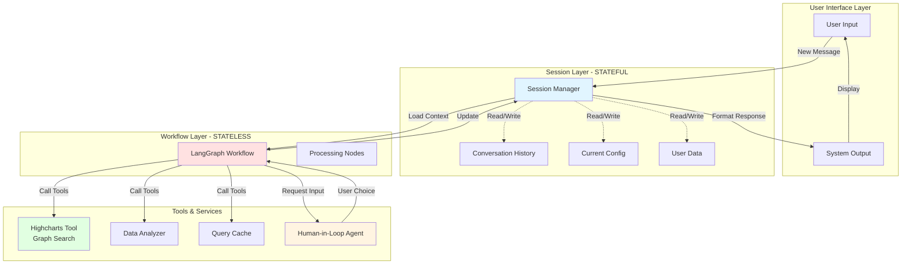

```mermaid 

graph TB
    subgraph "User Interface Layer"
        UI[User Input]
        OUT[System Output]
    end
    
    subgraph "Session Layer - STATEFUL"
        SM[Session Manager]
        HIST[Conversation History]
        CURR[Current Config]
        DATA[User Data]
    end
    
    subgraph "Workflow Layer - STATELESS"
        GRAPH[LangGraph Workflow]
        NODES[Processing Nodes]
    end
    
    subgraph "Tools & Services"
        HC[Highcharts Tool<br/>Graph Search]
        DA[Data Analyzer]
        CACHE[Query Cache]
        HITL[Human-in-Loop Agent]
    end
    
    UI -->|New Message| SM
    SM -->|Load Context| GRAPH
    GRAPH -->|Call Tools| HC
    GRAPH -->|Call Tools| DA
    GRAPH -->|Call Tools| CACHE
    GRAPH -->|Request Input| HITL
    HITL -->|User Choice| GRAPH
    GRAPH -->|Update| SM
    SM -->|Format Response| OUT
    OUT -->|Display| UI
    
    SM -.->|Read/Write| HIST
    SM -.->|Read/Write| CURR
    SM -.->|Read/Write| DATA
    
    style SM fill:#e1f5ff
    style GRAPH fill:#ffe1e1
    style HC fill:#e1ffe1
    style HITL fill:#fff4e1

```