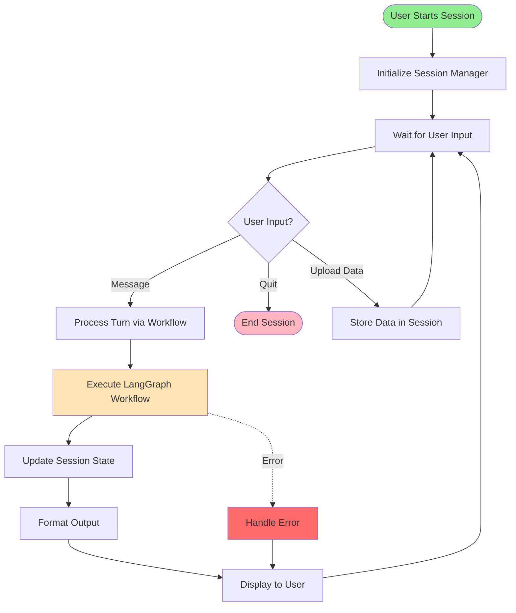

```mermaid

graph TD
    START([User Starts Session]) --> INIT[Initialize Session Manager]
    INIT --> WAIT[Wait for User Input]
    
    WAIT --> INPUT{User Input?}
    INPUT -->|Message| PROC[Process Turn via Workflow]
    INPUT -->|Quit| END([End Session])
    INPUT -->|Upload Data| STORE[Store Data in Session]
    
    STORE --> WAIT
    
    PROC --> WORKFLOW[Execute LangGraph Workflow]
    WORKFLOW --> UPDATE[Update Session State]
    UPDATE --> FORMAT[Format Output]
    FORMAT --> DISPLAY[Display to User]
    DISPLAY --> WAIT
    
    WORKFLOW -.->|Error| ERROR[Handle Error]
    ERROR --> DISPLAY
    
    style START fill:#90EE90
    style END fill:#FFB6C1
    style WORKFLOW fill:#FFE4B5
    style ERROR fill:#FF6B6B

```