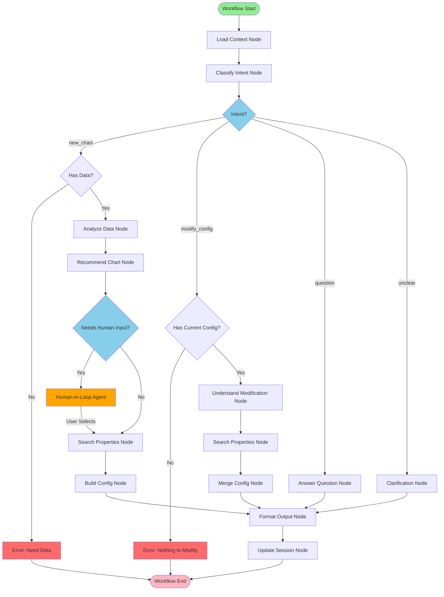

```mermaid

graph TD
    START([Workflow Start]) --> LOAD[Load Context Node]
    
    LOAD --> CLASSIFY[Classify Intent Node]
    
    CLASSIFY --> ROUTE{Intent?}
    
    ROUTE -->|new_chart| CHECK_DATA{Has Data?}
    ROUTE -->|modify_config| CHECK_CONFIG{Has Current Config?}
    ROUTE -->|question| ANSWER[Answer Question Node]
    ROUTE -->|unclear| CLARIFY[Clarification Node]
    
    CHECK_DATA -->|No| ERR1[Error: Need Data]
    CHECK_DATA -->|Yes| ANALYZE[Analyze Data Node]
    
    CHECK_CONFIG -->|No| ERR2[Error: Nothing to Modify]
    CHECK_CONFIG -->|Yes| UNDERSTAND[Understand Modification Node]
    
    ANALYZE --> RECOMMEND[Recommend Chart Node]
    
    RECOMMEND --> HITL_CHECK{Needs Human Input?}
    HITL_CHECK -->|Yes| HITL[Human-in-Loop Agent]
    HITL_CHECK -->|No| SEARCH1[Search Properties Node]
    HITL -->|User Selects| SEARCH1
    
    SEARCH1 --> BUILD[Build Config Node]
    
    UNDERSTAND --> SEARCH2[Search Properties Node]
    SEARCH2 --> MERGE[Merge Config Node]
    
    BUILD --> OUTPUT[Format Output Node]
    MERGE --> OUTPUT
    ANSWER --> OUTPUT
    CLARIFY --> OUTPUT
    
    OUTPUT --> SAVE[Update Session Node]
    
    SAVE --> END([Workflow End])
    ERR1 --> END
    ERR2 --> END
    
    style START fill:#90EE90
    style END fill:#FFB6C1
    style HITL fill:#FFA500
    style ERR1 fill:#FF6B6B
    style ERR2 fill:#FF6B6B
    style ROUTE fill:#87CEEB
    style HITL_CHECK fill:#87CEEB

```