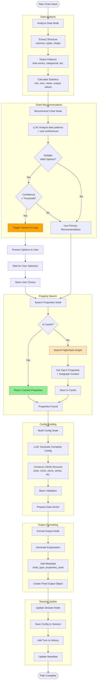

```mermaid

graph TD
    START([New Chart Intent]) --> ANALYZE[Analyze Data Node]
    
    subgraph "Data Analysis"
        ANALYZE --> STRUCT[Extract Structure<br/>columns, types, shape]
        STRUCT --> PATTERN[Detect Patterns<br/>time-series, categorical, etc.]
        PATTERN --> STATS[Calculate Statistics<br/>min, max, mean, unique values]
    end
    
    STATS --> RECOMMEND[Recommend Chart Node]
    
    subgraph "Chart Recommendation"
        RECOMMEND --> LLM1[LLM: Analyze data patterns<br/>+ user preferences]
        LLM1 --> MULTI{Multiple<br/>Valid Options?}
        MULTI -->|Yes| CONF{Confidence<br/>< Threshold?}
        MULTI -->|No| SINGLE[Use Primary Recommendation]
        CONF -->|Yes| HITL_TRIGGER[Trigger Human-in-Loop]
        CONF -->|No| SINGLE
    end
    
    HITL_TRIGGER --> HITL_PRESENT[Present Options to User]
    HITL_PRESENT --> HITL_WAIT[Wait for User Selection]
    HITL_WAIT --> HITL_STORE[Store User Choice]
    HITL_STORE --> SEARCH
    SINGLE --> SEARCH
    
    subgraph "Property Search"
        SEARCH[Search Properties Node] --> CACHE_CHECK{In Cache?}
        CACHE_CHECK -->|Yes| CACHE_HIT[Return Cached Properties]
        CACHE_CHECK -->|No| GRAPH_SEARCH[Search Highcharts Graph]
        GRAPH_SEARCH --> GRAPH_RES[Get Top-K Properties<br/>+ Subgraph Context]
        GRAPH_RES --> CACHE_STORE[Store in Cache]
        CACHE_HIT --> PROPS
        CACHE_STORE --> PROPS[Properties Found]
    end
    
    PROPS --> BUILD[Build Config Node]
    
    subgraph "Config Building"
        BUILD --> LLM2[LLM: Generate Complete Config]
        LLM2 --> CONSTRUCT[Construct JSON Structure<br/>chart, xAxis, yAxis, series, etc.]
        CONSTRUCT --> VALIDATE[Basic Validation]
        VALIDATE --> PREP_DATA[Prepare Data Series]
    end
    
    PREP_DATA --> FORMAT[Format Output Node]
    
    subgraph "Output Formatting"
        FORMAT --> EXPLAIN[Generate Explanation]
        EXPLAIN --> METADATA[Add Metadata<br/>chart_type, properties_used]
        METADATA --> FINAL[Create Final Output Object]
    end
    
    FINAL --> SAVE[Update Session Node]
    
    subgraph "Session Update"
        SAVE --> SAVE_CONFIG[Save Config to Session]
        SAVE_CONFIG --> SAVE_HIST[Add Turn to History]
        SAVE_HIST --> SAVE_META[Update Metadata]
    end
    
    SAVE_META --> END([Path Complete])
    
    style HITL_TRIGGER fill:#FFA500
    style CACHE_HIT fill:#90EE90
    style GRAPH_SEARCH fill:#FFE4B5

```