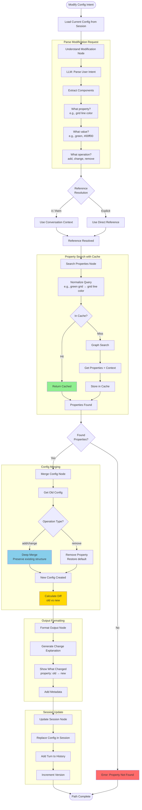

```mermaid

graph TD
    START([Modify Config Intent]) --> LOAD[Load Current Config from Session]
    
    LOAD --> UNDERSTAND[Understand Modification Node]
    
    subgraph "Parse Modification Request"
        UNDERSTAND --> LLM1[LLM: Parse User Intent]
        LLM1 --> EXTRACT[Extract Components]
        EXTRACT --> WHAT[What property?<br/>e.g., grid line color]
        WHAT --> VALUE[What value?<br/>e.g., green, #00ff00]
        VALUE --> OP[What operation?<br/>add, change, remove]
    end
    
    OP --> RESOLVE{Reference<br/>Resolution}
    RESOLVE -->|"it / them"| CONTEXT[Use Conversation Context]
    RESOLVE -->|Explicit| DIRECT[Use Direct Reference]
    CONTEXT --> REF_RESOLVED[Reference Resolved]
    DIRECT --> REF_RESOLVED
    
    REF_RESOLVED --> SEARCH[Search Properties Node]
    
    subgraph "Property Search with Cache"
        SEARCH --> NORM[Normalize Query<br/>e.g., green grid → grid line color]
        NORM --> CACHE_CHK{In Cache?}
        CACHE_CHK -->|Hit| C_HIT[Return Cached]
        CACHE_CHK -->|Miss| G_SEARCH[Graph Search]
        G_SEARCH --> G_RES[Get Properties + Context]
        G_RES --> C_STORE[Store in Cache]
        C_HIT --> PROPS
        C_STORE --> PROPS[Properties Found]
    end
    
    PROPS --> CHECK{Found<br/>Properties?}
    CHECK -->|No| ERROR[Error: Property Not Found]
    CHECK -->|Yes| MERGE[Merge Config Node]
    
    subgraph "Config Merging"
        MERGE --> GET_OLD[Get Old Config]
        GET_OLD --> OPERATION{Operation Type?}
        
        OPERATION -->|add/change| DEEP_MERGE[Deep Merge<br/>Preserve existing structure]
        OPERATION -->|remove| REMOVE_PROP[Remove Property<br/>Restore default]
        
        DEEP_MERGE --> NEW_CONFIG[New Config Created]
        REMOVE_PROP --> NEW_CONFIG
        
        NEW_CONFIG --> DIFF[Calculate Diff<br/>old vs new]
    end
    
    DIFF --> FORMAT[Format Output Node]
    
    subgraph "Output Formatting"
        FORMAT --> EXPLAIN[Generate Change Explanation]
        EXPLAIN --> SHOW_DIFF[Show What Changed<br/>property: old → new]
        SHOW_DIFF --> META[Add Metadata]
    end
    
    META --> SAVE[Update Session Node]
    
    subgraph "Session Update"
        SAVE --> REPLACE[Replace Config in Session]
        REPLACE --> HIST[Add Turn to History]
        HIST --> VERSION[Increment Version]
    end
    
    VERSION --> END([Path Complete])
    ERROR --> END
    
    style ERROR fill:#FF6B6B
    style C_HIT fill:#90EE90
    style DEEP_MERGE fill:#87CEEB
    style DIFF fill:#FFD700

```