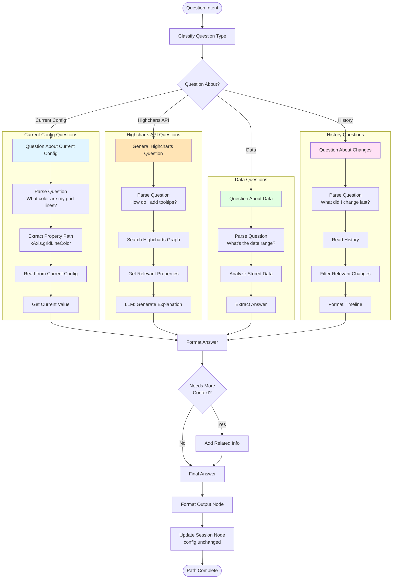

```mermaid

graph TD
    START([Question Intent]) --> CLASSIFY[Classify Question Type]
    
    CLASSIFY --> TYPE{Question About?}
    
    TYPE -->|Current Config| Q_CONFIG[Question About Current Config]
    TYPE -->|Highcharts API| Q_API[General Highcharts Question]
    TYPE -->|Data| Q_DATA[Question About Data]
    TYPE -->|History| Q_HIST[Question About Changes]
    
    subgraph "Current Config Questions"
        Q_CONFIG --> PARSE_C[Parse Question<br/>What color are my grid lines?]
        PARSE_C --> EXTRACT_C[Extract Property Path<br/>xAxis.gridLineColor]
        EXTRACT_C --> READ_C[Read from Current Config]
        READ_C --> VALUE_C[Get Current Value]
    end
    
    subgraph "Highcharts API Questions"
        Q_API --> PARSE_API[Parse Question<br/>How do I add tooltips?]
        PARSE_API --> SEARCH_API[Search Highcharts Graph]
        SEARCH_API --> PROPS_API[Get Relevant Properties]
        PROPS_API --> EXPLAIN_API[LLM: Generate Explanation]
    end
    
    subgraph "Data Questions"
        Q_DATA --> PARSE_D[Parse Question<br/>What's the date range?]
        PARSE_D --> ANALYZE_D[Analyze Stored Data]
        ANALYZE_D --> VALUE_D[Extract Answer]
    end
    
    subgraph "History Questions"
        Q_HIST --> PARSE_H[Parse Question<br/>What did I change last?]
        PARSE_H --> READ_H[Read History]
        READ_H --> FILTER_H[Filter Relevant Changes]
        FILTER_H --> VALUE_H[Format Timeline]
    end
    
    VALUE_C --> ANSWER[Format Answer]
    EXPLAIN_API --> ANSWER
    VALUE_D --> ANSWER
    VALUE_H --> ANSWER
    
    ANSWER --> CONTEXT{Needs More<br/>Context?}
    CONTEXT -->|Yes| ADD_CONTEXT[Add Related Info]
    CONTEXT -->|No| FINAL
    ADD_CONTEXT --> FINAL[Final Answer]
    
    FINAL --> OUTPUT[Format Output Node]
    OUTPUT --> SAVE[Update Session Node<br/>config unchanged]
    SAVE --> END([Path Complete])
    
    style Q_CONFIG fill:#E1F5FF
    style Q_API fill:#FFE4B5
    style Q_DATA fill:#E1FFE1
    style Q_HIST fill:#FFE1F5

```