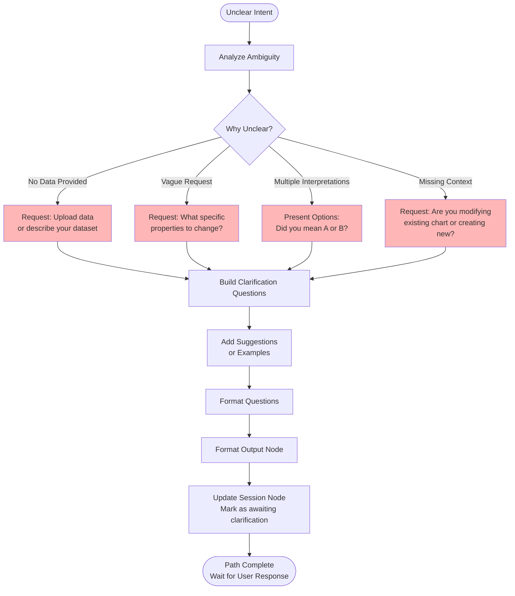

```mermaid

graph TD
    START([Unclear Intent]) --> ANALYZE[Analyze Ambiguity]
    
    ANALYZE --> REASON{Why Unclear?}
    
    REASON -->|No Data Provided| NEED_DATA[Request: Upload data<br/>or describe your dataset]
    REASON -->|Vague Request| NEED_DETAILS[Request: What specific<br/>properties to change?]
    REASON -->|Multiple Interpretations| NEED_CHOICE[Present Options:<br/>Did you mean A or B?]
    REASON -->|Missing Context| NEED_CONTEXT[Request: Are you modifying<br/>existing chart or creating new?]
    
    NEED_DATA --> BUILD_Q[Build Clarification Questions]
    NEED_DETAILS --> BUILD_Q
    NEED_CHOICE --> BUILD_Q
    NEED_CONTEXT --> BUILD_Q
    
    BUILD_Q --> SUGGEST[Add Suggestions<br/>or Examples]
    
    SUGGEST --> FORMAT[Format Questions]
    
    FORMAT --> OUTPUT[Format Output Node]
    
    OUTPUT --> SAVE[Update Session Node<br/>Mark as awaiting clarification]
    
    SAVE --> END([Path Complete<br/>Wait for User Response])
    
    style NEED_DATA fill:#FFB6B6
    style NEED_DETAILS fill:#FFB6B6
    style NEED_CHOICE fill:#FFB6B6
    style NEED_CONTEXT fill:#FFB6B6

```