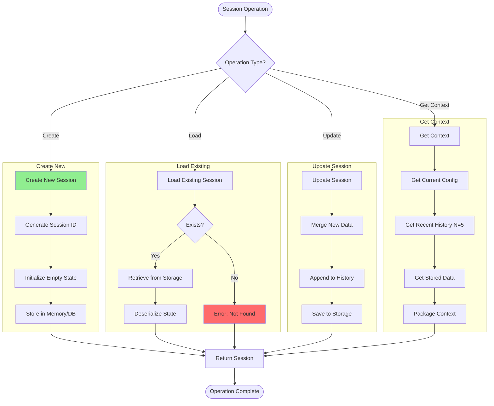

```mermaid

graph TD
    START([Session Operation]) --> OP{Operation Type?}
    
    OP -->|Create| CREATE[Create New Session]
    OP -->|Load| LOAD[Load Existing Session]
    OP -->|Update| UPDATE[Update Session]
    OP -->|Get Context| CONTEXT[Get Context]
    
    subgraph "Create New"
        CREATE --> GEN_ID[Generate Session ID]
        GEN_ID --> INIT[Initialize Empty State]
        INIT --> STORE_C[Store in Memory/DB]
    end
    
    subgraph "Load Existing"
        LOAD --> CHECK{Exists?}
        CHECK -->|Yes| RETRIEVE[Retrieve from Storage]
        CHECK -->|No| ERR[Error: Not Found]
        RETRIEVE --> DESERIALIZE[Deserialize State]
    end
    
    subgraph "Update Session"
        UPDATE --> MERGE_U[Merge New Data]
        MERGE_U --> APPEND_H[Append to History]
        APPEND_H --> SAVE_U[Save to Storage]
    end
    
    subgraph "Get Context"
        CONTEXT --> GET_CONFIG[Get Current Config]
        GET_CONFIG --> GET_HIST[Get Recent History N=5]
        GET_HIST --> GET_DATA[Get Stored Data]
        GET_DATA --> PACKAGE[Package Context]
    end
    
    STORE_C --> RETURN[Return Session]
    DESERIALIZE --> RETURN
    SAVE_U --> RETURN
    PACKAGE --> RETURN
    ERR --> RETURN
    
    RETURN --> END([Operation Complete])
    
    style CREATE fill:#90EE90
    style ERR fill:#FF6B6B

```