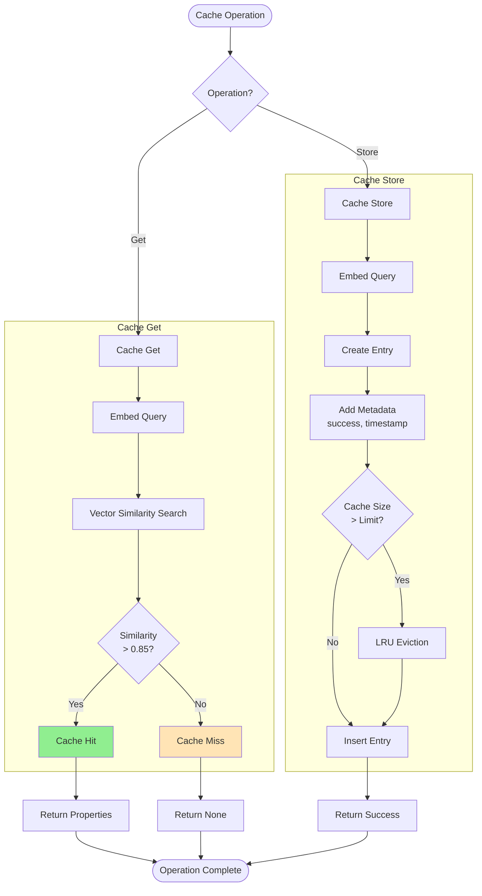

```mermaid

graph TD
    START([Cache Operation]) --> OP{Operation?}
    
    OP -->|Get| GET[Cache Get]
    OP -->|Store| STORE[Cache Store]
    
    subgraph "Cache Get"
        GET --> EMBED_Q[Embed Query]
        EMBED_Q --> SEARCH_V[Vector Similarity Search]
        SEARCH_V --> THRESHOLD{Similarity<br/>> 0.85?}
        THRESHOLD -->|Yes| HIT[Cache Hit]
        THRESHOLD -->|No| MISS[Cache Miss]
    end
    
    subgraph "Cache Store"
        STORE --> EMBED_S[Embed Query]
        EMBED_S --> CREATE_E[Create Entry]
        CREATE_E --> ADD_META[Add Metadata<br/>success, timestamp]
        ADD_META --> SIZE_CHECK{Cache Size<br/>> Limit?}
        SIZE_CHECK -->|Yes| EVICT[LRU Eviction]
        SIZE_CHECK -->|No| INSERT
        EVICT --> INSERT[Insert Entry]
    end
    
    HIT --> RETURN_H[Return Properties]
    MISS --> RETURN_M[Return None]
    INSERT --> RETURN_S[Return Success]
    
    RETURN_H --> END([Operation Complete])
    RETURN_M --> END
    RETURN_S --> END
    
    style HIT fill:#90EE90
    style MISS fill:#FFE4B5

```