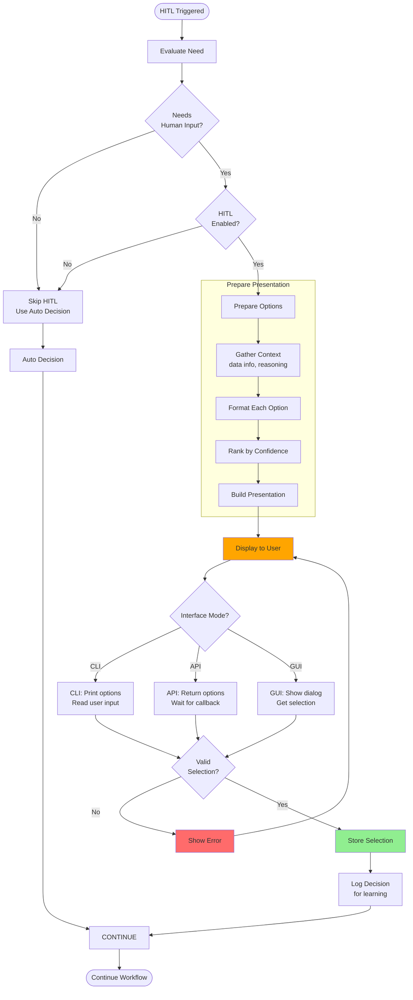

```mermaid

graph TD
    START([HITL Triggered]) --> EVAL[Evaluate Need]
    
    EVAL --> CHECK{Needs<br/>Human Input?}
    
    CHECK -->|No| SKIP[Skip HITL<br/>Use Auto Decision]
    CHECK -->|Yes| ENABLED{HITL<br/>Enabled?}
    
    ENABLED -->|No| SKIP
    ENABLED -->|Yes| PREPARE[Prepare Options]
    
    subgraph "Prepare Presentation"
        PREPARE --> CONTEXT[Gather Context<br/>data info, reasoning]
        CONTEXT --> FORMAT[Format Each Option]
        FORMAT --> RANK[Rank by Confidence]
        RANK --> BUILD[Build Presentation]
    end
    
    BUILD --> DISPLAY[Display to User]
    
    DISPLAY --> MODE{Interface Mode?}
    
    MODE -->|CLI| CLI_INPUT[CLI: Print options<br/>Read user input]
    MODE -->|API| API_WAIT[API: Return options<br/>Wait for callback]
    MODE -->|GUI| GUI_DIALOG[GUI: Show dialog<br/>Get selection]
    
    CLI_INPUT --> VALIDATE
    API_WAIT --> VALIDATE
    GUI_DIALOG --> VALIDATE
    
    VALIDATE{Valid<br/>Selection?}
    VALIDATE -->|No| ERROR[Show Error]
    ERROR --> DISPLAY
    VALIDATE -->|Yes| STORE[Store Selection]
    
    STORE --> LOG[Log Decision<br/>for learning]
    
    SKIP --> AUTO[Auto Decision]
    LOG --> CONTINUE
    AUTO --> CONTINUE
    
    CONTINUE --> END([Continue Workflow])
    
    style DISPLAY fill:#FFA500
    style ERROR fill:#FF6B6B
    style STORE fill:#90EE90

```