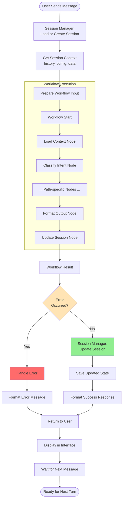

```mermaid

graph TD
    START([User Sends Message]) --> SM_LOAD[Session Manager:<br/>Load or Create Session]
    
    SM_LOAD --> CTX[Get Session Context<br/>history, config, data]
    
    CTX --> WF_INPUT[Prepare Workflow Input]
    
    subgraph "Workflow Execution"
        WF_INPUT --> WF_START[Workflow Start]
        WF_START --> N1[Load Context Node]
        N1 --> N2[Classify Intent Node]
        N2 --> N3[... Path-specific Nodes ...]
        N3 --> N4[Format Output Node]
        N4 --> N5[Update Session Node]
    end
    
    N5 --> WF_RESULT[Workflow Result]
    
    WF_RESULT --> ERROR_CHECK{Error<br/>Occurred?}
    
    ERROR_CHECK -->|Yes| HANDLE[Handle Error]
    ERROR_CHECK -->|No| SM_UPDATE[Session Manager:<br/>Update Session]
    
    HANDLE --> FORMAT_ERR[Format Error Message]
    FORMAT_ERR --> OUTPUT
    
    SM_UPDATE --> SM_SAVE[Save Updated State]
    SM_SAVE --> FORMAT_SUCCESS[Format Success Response]
    FORMAT_SUCCESS --> OUTPUT
    
    OUTPUT[Return to User] --> DISPLAY[Display in Interface]
    
    DISPLAY --> WAIT[Wait for Next Message]
    
    WAIT --> END([Ready for Next Turn])
    
    style ERROR_CHECK fill:#FFE4B5
    style HANDLE fill:#FF6B6B
    style SM_UPDATE fill:#90EE90

``` 