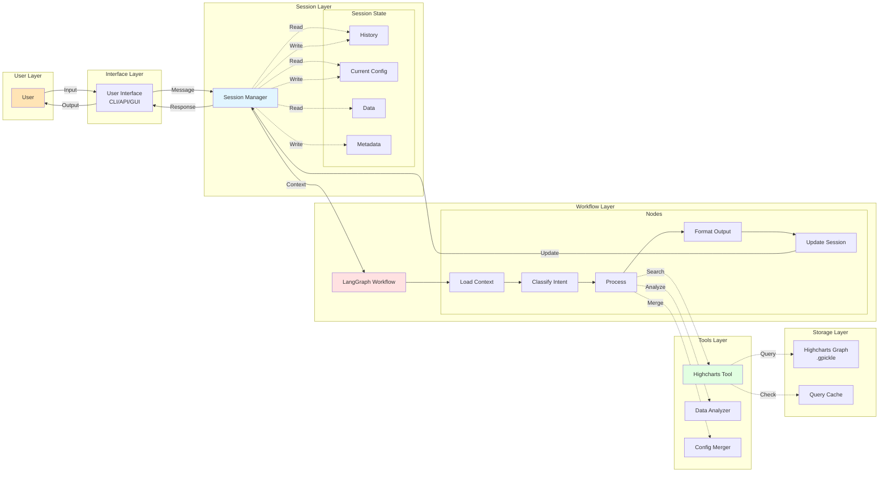

```mermaid

graph LR
    subgraph "User Layer"
        U[User]
    end
    
    subgraph "Interface Layer"
        UI[User Interface<br/>CLI/API/GUI]
    end
    
    subgraph "Session Layer"
        SM[Session Manager]
        
        subgraph "Session State"
            HIST[History]
            CONFIG[Current Config]
            DATA[Data]
            META[Metadata]
        end
    end
    
    subgraph "Workflow Layer"
        WF[LangGraph Workflow]
        
        subgraph "Nodes"
            N1[Load Context]
            N2[Classify Intent]
            N3[Process]
            N4[Format Output]
            N5[Update Session]
        end
    end
    
    subgraph "Tools Layer"
        HCT[Highcharts Tool]
        DAT[Data Analyzer]
        CMT[Config Merger]
    end
    
    subgraph "Storage Layer"
        GR[Highcharts Graph<br/>.gpickle]
        CA[Query Cache]
    end
    
    U -->|Input| UI
    UI -->|Message| SM
    SM -.->|Read| HIST
    SM -.->|Read| CONFIG
    SM -.->|Read| DATA
    
    SM -->|Context| WF
    WF --> N1
    N1 --> N2
    N2 --> N3
    N3 --> N4
    N4 --> N5
    
    N3 -.->|Search| HCT
    N3 -.->|Analyze| DAT
    N3 -.->|Merge| CMT
    
    HCT -.->|Query| GR
    HCT -.->|Check| CA
    
    N5 -->|Update| SM
    SM -.->|Write| HIST
    SM -.->|Write| CONFIG
    SM -.->|Write| META
    
    SM -->|Response| UI
    UI -->|Output| U
    
    style U fill:#FFE4B5
    style SM fill:#E1F5FF
    style WF fill:#FFE1E1
    style HCT fill:#E1FFE1

```