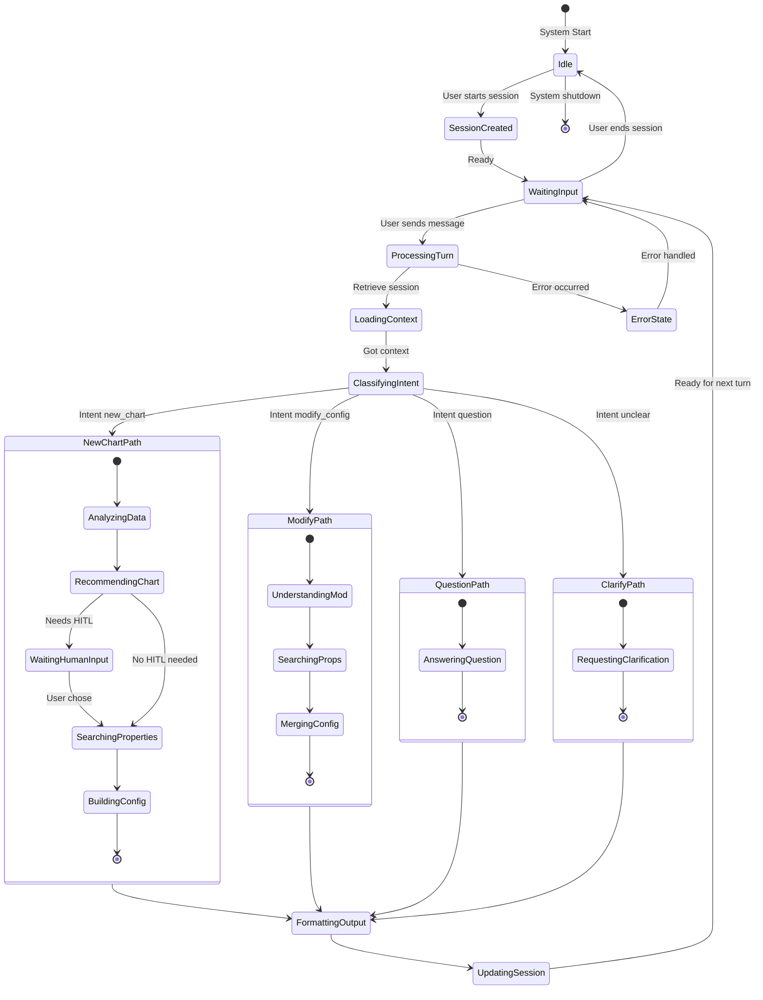

```mermaid

stateDiagram-v2
    [*] --> Idle: System Start
    
    Idle --> SessionCreated: User starts session
    SessionCreated --> WaitingInput: Ready
    
    WaitingInput --> ProcessingTurn: User sends message
    
    ProcessingTurn --> LoadingContext: Retrieve session
    LoadingContext --> ClassifyingIntent: Got context
    
    ClassifyingIntent --> NewChartPath: Intent new_chart
    ClassifyingIntent --> ModifyPath: Intent modify_config
    ClassifyingIntent --> QuestionPath: Intent question
    ClassifyingIntent --> ClarifyPath: Intent unclear
    
    state NewChartPath {
        [*] --> AnalyzingData
        AnalyzingData --> RecommendingChart
        RecommendingChart --> WaitingHumanInput: Needs HITL
        WaitingHumanInput --> SearchingProperties: User chose
        RecommendingChart --> SearchingProperties: No HITL needed
        SearchingProperties --> BuildingConfig
        BuildingConfig --> [*]
    }
    
    state ModifyPath {
        [*] --> UnderstandingMod
        UnderstandingMod --> SearchingProps
        SearchingProps --> MergingConfig
        MergingConfig --> [*]
    }
    
    state QuestionPath {
        [*] --> AnsweringQuestion
        AnsweringQuestion --> [*]
    }
    
    state ClarifyPath {
        [*] --> RequestingClarification
        RequestingClarification --> [*]
    }
    
    NewChartPath --> FormattingOutput
    ModifyPath --> FormattingOutput
    QuestionPath --> FormattingOutput
    ClarifyPath --> FormattingOutput
    
    FormattingOutput --> UpdatingSession
    UpdatingSession --> WaitingInput: Ready for next turn
    
    ProcessingTurn --> ErrorState: Error occurred
    ErrorState --> WaitingInput: Error handled
    
    WaitingInput --> Idle: User ends session
    Idle --> [*]: System shutdown

```